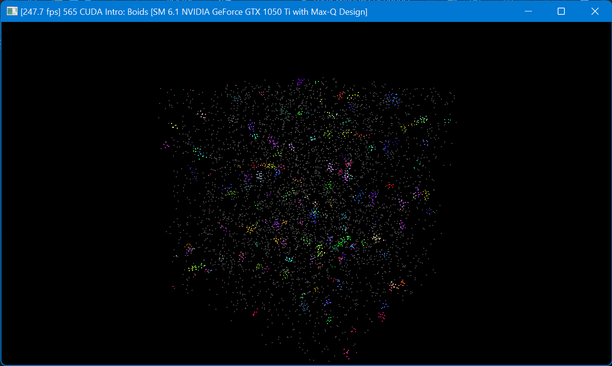
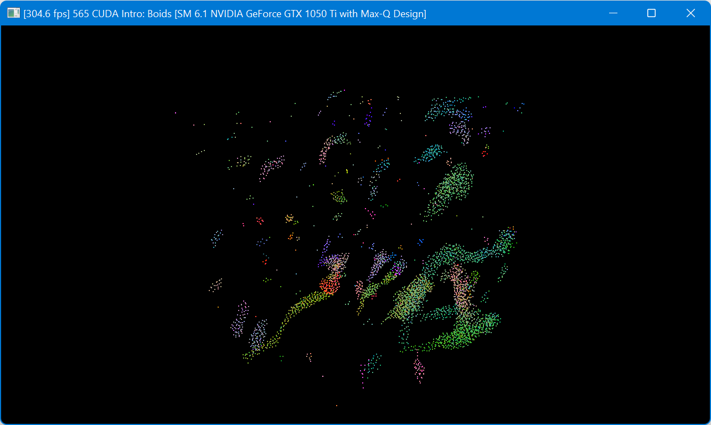
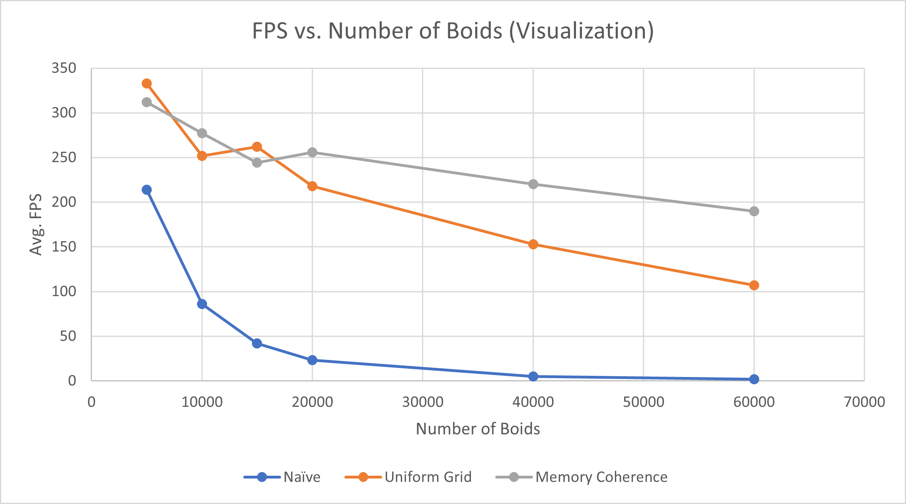
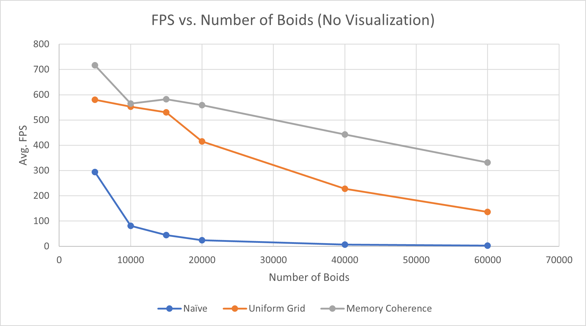
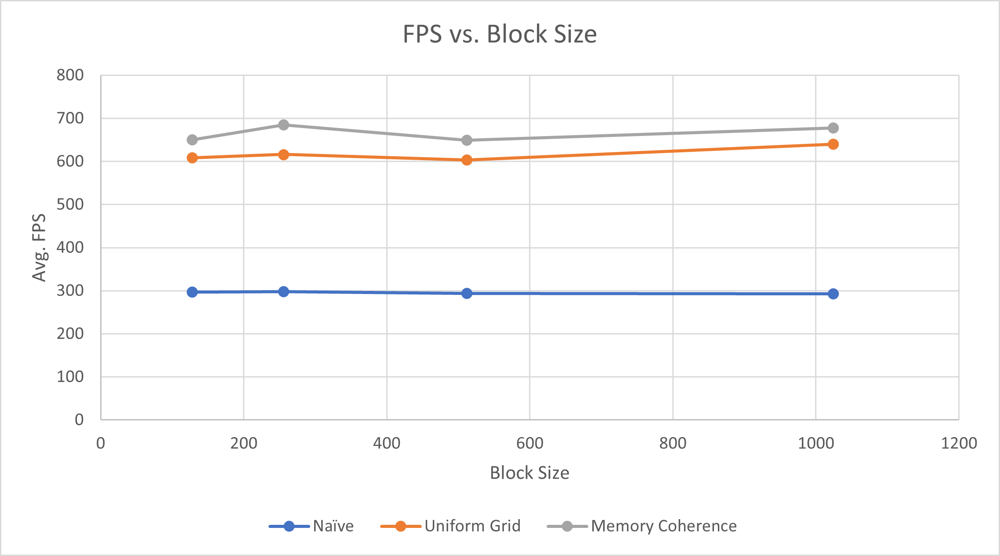

**University of Pennsylvania, CIS 565: GPU Programming and Architecture,
Project 1 - Flocking**

* Aditya Hota
  * [LinkedIn](https://www.linkedin.com/in/aditya-hota)
* Tested on: Windows 11, i7-8750H @ 2.20 GHz 20 GB, GTX 1050 Ti with Max-Q Design 6 GB (personal laptop)

# Overview
This project involved implementing several algorithms to simulate movements of Boid particles. We started off with a naive implementation, then made optimizations to improve parallelism and reduce the number of memory accesses.

# Screenshots
Video
 

Early in execution
 

Later on in execution
 

# Functionality
Boids move according to three rules. These were implemented across threads to allow for a level of parallelism across GPU cores.

1) Boids try to fly towards the centre of mass of neighboring boids.
2) Boids try to keep a small distance away from other objects (including other boids).
3) Boids try to match velocity with near boids.

The pseudocode for algorithms was provided in the instructions. See [here](INSTRUCTION.md).

## 1.2 Naive implementation
The first version of the implementation involved each boid naively checking all other boids to determine how the boid in question should change its velocity.

## 2.1 Uniform grids
Boids are only influenced by others near it, so we do not need to check all other N-1 boids every time step. Instead, we can find a way to check which boids are near the one in question.

We do this by creating a uniform grid of cells, representing quantized parts of the overall space. Then, for each boid, we figure out which cell the boid is in. We can sort the array of cells along with the array of boids, then store the starting and ending positions of cells within the overall cell array. Boinds in a cell with have their position and velocity array indices stored between the starting and ending positions.

Lastly, when finding the closest neighbors for each boid, we see which cells are near it--we do this by seeing if the boid is in the lower or upper half of a dimension, and checking the neighboring cell closest in that direction. Then, we use the uniform grid of cells to see which boids are in the cells. Only these boids are used to influce the current boid's velocity.

## 2.3 Uniform grids with memory coherency
In the [uniform grids](##2.1-Uniform-Grids) section, for each boid we stored the index of where we can find its position and velocity. Now, we make an optimization which allows us to use the same index within the cell array. This reduces the number of redirections and random accesses that we have to perform.

# Performance Analysis
FPS is used as the primary metric of performance analysis. Frame are uncapped (v-sync off), which means the simulation is running as fast as possible.

I added code to track the average FPS over the complete execution of the program. Average FPS value was over was 15 seconds of execution.

## Graphs
### Increasing Boids (with visualization)
As shown in the graph below, increasing the number of boids causes the FPS to decrease with all levels of optimizations. However, we see that the naive solution has an exponential decrease whereas both uniform grids decrease inearly. Since the memory coherency optimization has fewer memory accesses, its performance decreases at a slower rate.

### Increasing Boids (without visualization)
We see the same trends as above, but just with higher average frame rates since the boids do not need to be rendered.

### Increasing Block Size
We see that there is no impact to the FPS when the block size is changed.

## Questions
1) Increasing the number of boids causes the FPS to decrease because there are more checks that need to be done and a larger number of kernels to run. Since there are more boids, the naive solution will have to check more boids and the optimized solutions are more likely to have more close neighbors per boid.

2) Changing the block size and number of blocks does not change the FPS because we are only changing how the kernels are divided across the GPU SMs. Each SM can only run one warp (one operation in parallel) at a time, so no higher quantity of operations is being run at one time.

3) There was a performance improvement with coherent uniform grid. This is because we are not redirecting through an additional matrix to get the position and velocity array indices for boids. That is one less warp to complete. Furthermore, the memory accesses to the positon and velocity are more contiguous so there may be optimizations such as data prefetching.

4) Changing the number of neighbors to 27 causes the performance to actually improve, because we are checking smaller volumes. This makes our checking volume more quantized, so we may end up having fewer boids to check thatn before.