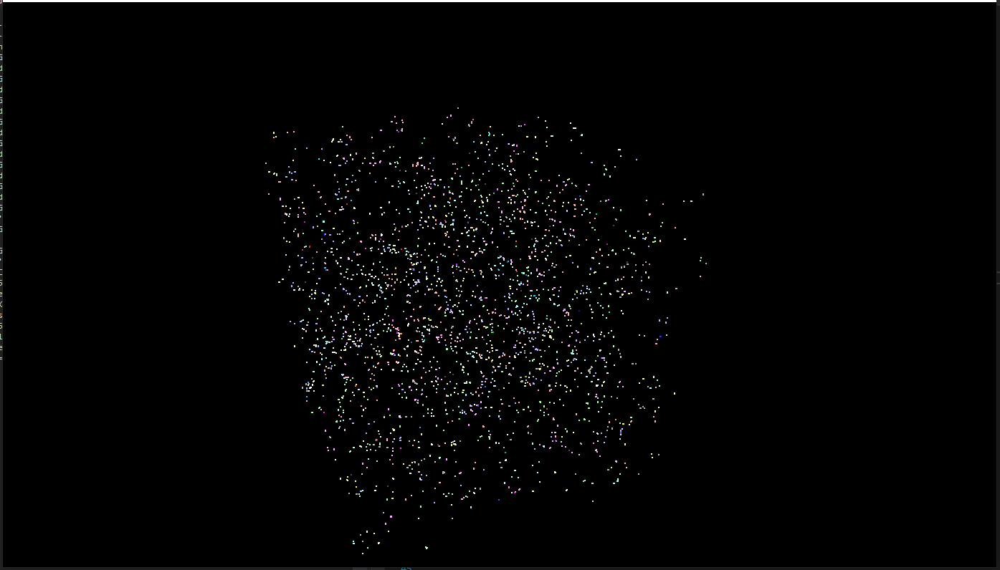

Project 0 Getting Started
====================

**University of Pennsylvania, CIS 565: GPU Programming and Architecture, Project 0**

* Shubham Sharma
  * [LinkedIn](www.linkedin.com/in/codeshubham), [personal website](https://shubhvr.com/).
* Tested on: Windows 10, i7-9750H @ 2.26GHz, 16GB, GTX 1660ti 6GB (Personal Computer).
*GPU Compute Capability: 7.5

# Project Overview #
Several techniques were implemented in this research to simulate the movements of Boid particles. We started with a rudimentary implementation and then tweaked it to increase parallelism and reduce memory requests.

## Simulation Images
Simulation Begins: Early on in execution the boids are scattered randomly throughout the space

Simulation Continues: Boids begin to travel in flocks with their neighbors forming groups

## Simulation Videos : 50000 Boids

# Implementation #
Boids move according to three rules. These were implemented across threads to allow for a level of parallelism across GPU cores.

-Boids try to fly towards the centre of mass of neighboring boids.
-Boids try to keep a small distance away from other objects (including other boids).
-Boids try to match velocity with near boids.

## 1.2 Naive Implementation
In the first iteration of the implementation, each boid checked all other boids naively to see how the boid in question should modify its velocity.

## 2.1 Uniform grids
We don't need to examine all other boids every time step because boids are only influenced by their neighbors. Instead, we can figure out how to see which boids are in close proximity.

We finish this by setting up a uniform network of cells over the recreation space, breaking it up into cubic locales. These locales can be conceptualised as Frameworks. Presently for each boid we must decide which network cell contains the boid. As a last preprocessing step, we are able walk through the recently sorted framework cell esteem cluster to compute beginning and finishing positions for each cell that's valuable when performing the boid computations.

##2.3 Grids with Memory Coherency
In the uniform grid section, for each boid we put away the record of where we can discover its position and speed. Presently, we make an improvement which permits us to utilize a similar list inside the cell exhibit. This lessens the quantity of redirections and arbitrary gets to that we need to perform.

# Performance Analysis #

FPS is utilized as the essential measurement of execution investigation. Edge are uncapped (v-sync off), which implies the reproduction is running at its maximum value. 

Below Graphs Represent recoreded FPS with respect to the number of boids. Below data is averaged out over 10 seconds of execution.

(images/Graph_30000.PNG)

(images/Graph_50000.PNG)