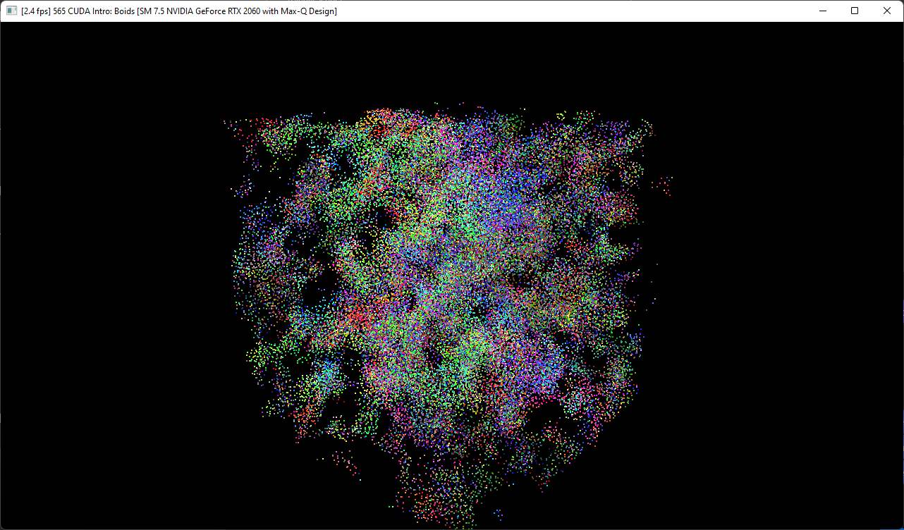
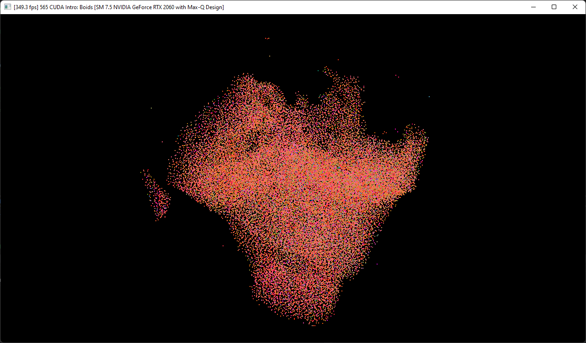
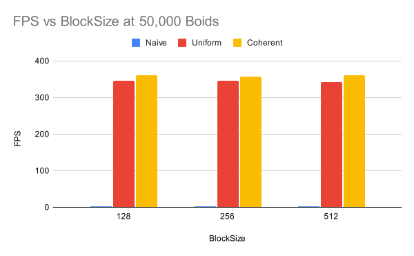

**University of Pennsylvania, CIS 565: GPU Programming and Architecture,
Project 1 - Flocking**

* Richard Chen
  * [LinkedIn](https://www.linkedin.com/in/richardrlchen)
* Tested on: Windows 11, i7-10875H @ 2.3GHz 16GB, RTX 2060 MAX-Q 6GB (Personal Computer)

## Overview
This project involved computing and rendering flocks of boids all on the GPU. 
First was a naive O(n^2) approach that involved pairwise checking all the boids. 
Next, a uniform grid data structure was employed so that only close boids would be checked, reducing the amount of math needed. Lastly, the uniform grid was improved by rearranging the buffers on the GPU rather than adding a layer of indirection. This should greatly improve memory access times.  

## Videos and Images
100,000 Boids  
   
    
  
10,000 Boids    
   

### Naive Implementation
Naive barely handles 50k Boids
 

### Uniform Grid
Uniform Grid handles 50k Boids just fine
 

## Performance
Visualize On
 

Visualize Off
 

* As the number of boids increases, the naive approach does not scale
* At lower boid numbers, the coherent approach incurs overhead from reshuffling arrays but with more boids, the memory indirection time saved overcomes this

Block Size
 

## Questions
* Increasing the boids increases the number of computations needed. With the naive 
implmentation acting on every pair, it is O(n^2) while for the spatial grid based
implementations, the repelling behavior at close distances means that we should not 
hit the strict n choose 2 case. 
* Each Streaming Multiprocessor runs one warp at a time so as long as all the SMs are saturated, 
there should not be a significant difference
* The coherent grid trades some extra copies and assigns to avoid reading from slow memory and needing to refresh the cache. With a small number of boids, the overhead outweighs the time saved but large boid numbers is where it shines
* The performance was slightly slower but perhaps it could have benefits as the physical area being checked is smaller, it just has to be done in a way that the extra checks overhead is compensated for by the time saved checking a smaller area, perhaps with high boid density and large grid squares. As it currently was for 
50,000 boids on the coherent implmentation, the fps dropped from around 360 to 333. 

