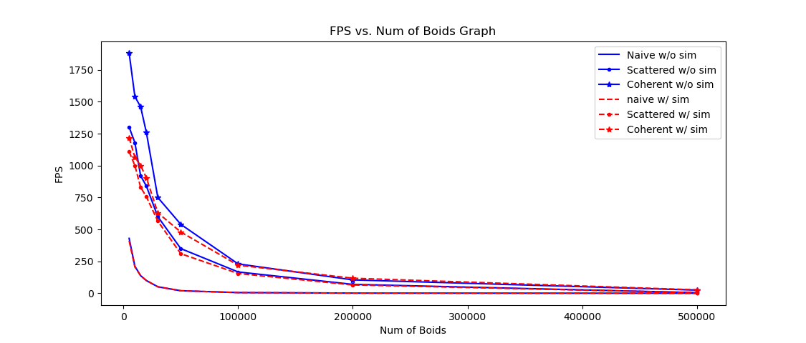
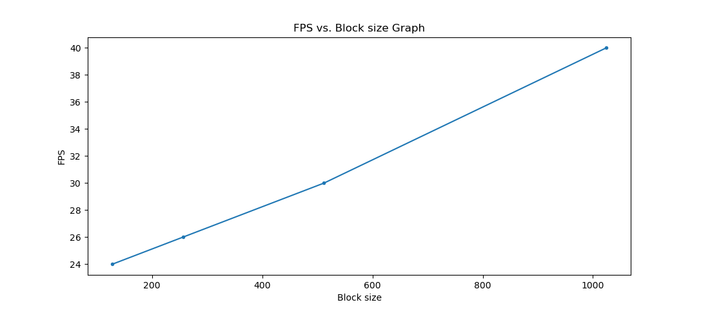

**University of Pennsylvania, CIS 565: GPU Programming and Architecture,
Project 1 - Flocking**

* Zhihao Ruan (ruanzh@seas.upenn.edu)
  * [LinkedIn](https://www.linkedin.com/in/zhihao-ruan-29b29a13a/), [personal website](https://zhihaoruan.xyz/)
* Tested on: Ubuntu 20.04 LTS, Ryzen 3700X @ 2.22GHz 48GB, RTX 2060 Super @ 7976MB

## Introduction: Flocking Simulation

Flocking is defined as the action of a crowd. In nature, flocking often happens on a crowd of birds or a school of fish. Birds, for example, often fly together as a whole in the sky, moving from one position to another. Although the shape of the crowd might change a lot, it is very amazing that each bird flies as if they knew the next steps of all other birds, so that it would never diverge from the crowd and they always stay together.

Biologists have been studying the behavior of flocking for a long time. In such context, we would also call each individual a **boid**. One might very easily start to wonder whether there is any type of communications taking place within the crowd so that they could maintain as a whole. Unfortunately, however, there is no such communication mechanism between each two individuals. In fact, according to the [notes from Conrad Parker](http://www.vergenet.net/~conrad/boids/), each individual would be able to stay close to other boids as long as they follow 3 simple rules:
1. Boids try to fly towards the centre of mass of neighboring boids.
2. Boids try to keep a small distance away from other objects (including other boids).
3. Boids try to match velocity with near boids.

The objective of this project would be to build a flocking simulation using CUDA with these 3 simple rules. A demo of the final result has been showed right above this section.

## Performance Analysis
**For each implementation, how does changing the number of boids affect performance? Why do you think this is?**
- The FPS would decrease as the number of boids increases. This is because GPU needs to compute more boid states and thus needs more threads to finish simulation per time step.

**For each implementation, how does changing the block count and block size affect performance? Why do you think this is?**
- The FPS would increase as the block size increases. This is because more boids could be computed in parallel in one block as the block size increases, thus boosting the performance. 

**For the coherent uniform grid: did you experience any performance improvements with the more coherent uniform grid? Was this the outcome you expected? Why or why not?**
- My performance did improve with coherent grid compared to scattered grid. This outcome was expected as GPU would pull out one chunk of memory at a time for a warp to access, and thus with coherent grid all threads in one warp would read the same chunk of data pulled out from GPU memory, thus reducing the memory I/O.

### FPS Graph Plots

**FPS change with increasing number of boids in different modes:**

**FPS change with different block size (uniform coherent grid, number of boids set to 50k):**

