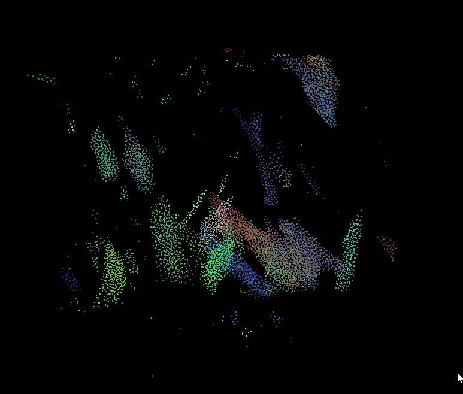
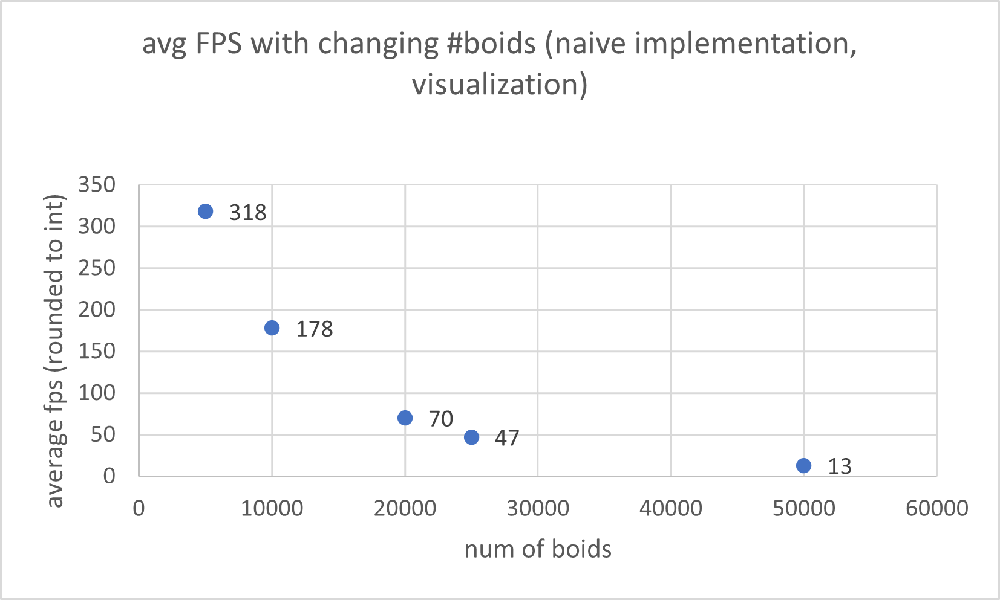
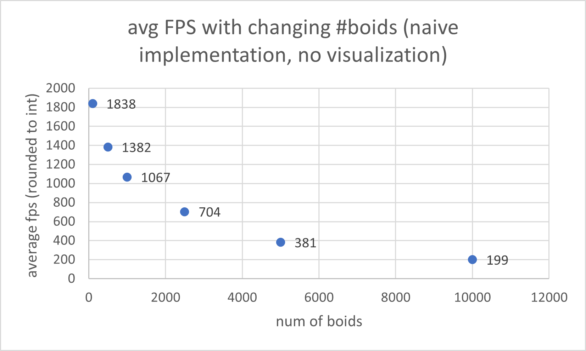
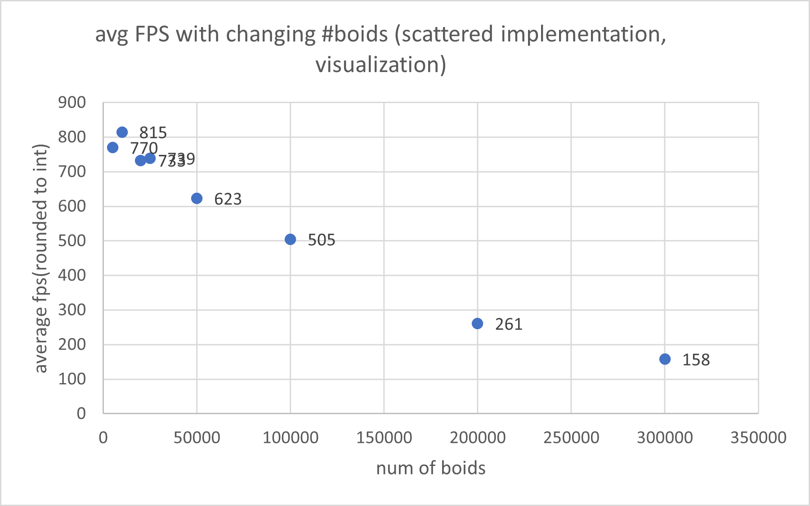
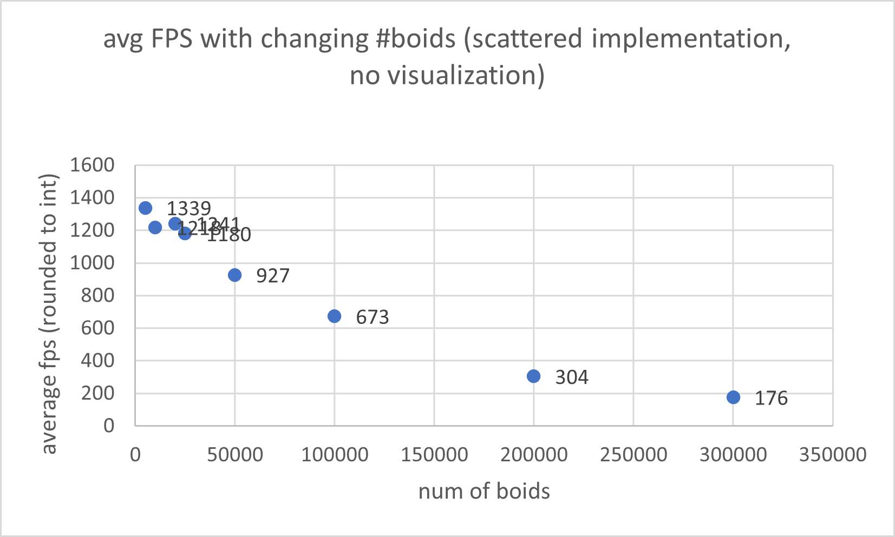
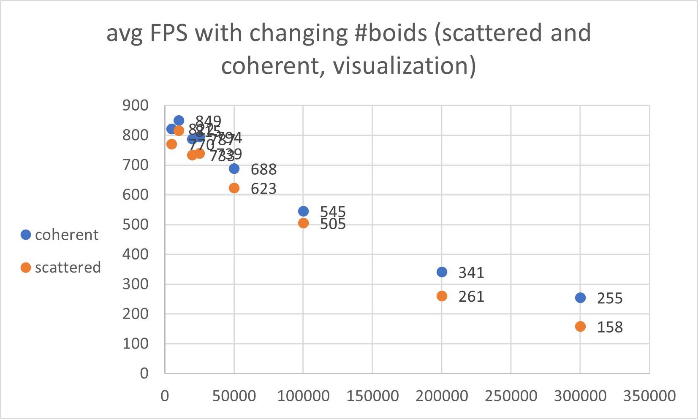
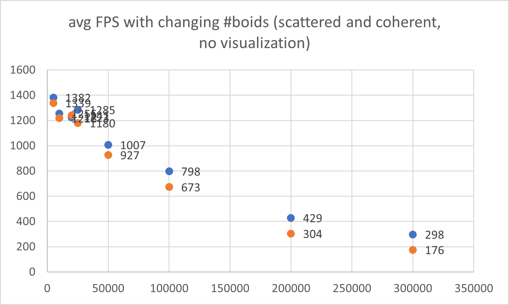
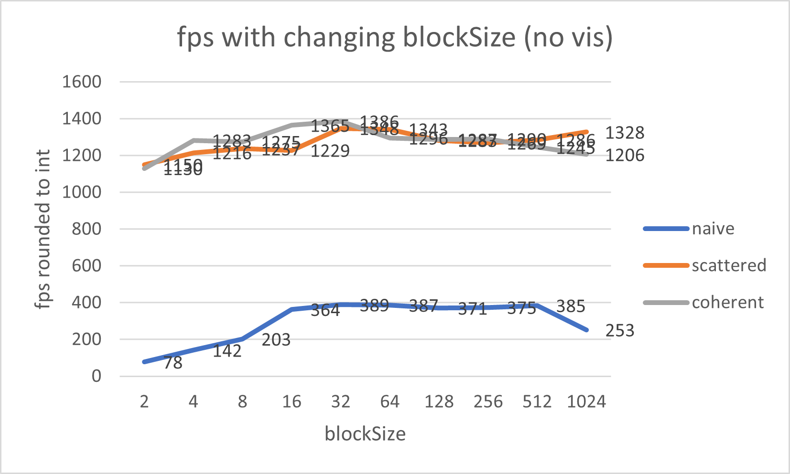

**University of Pennsylvania, CIS 565: GPU Programming and Architecture,
Project 1 - Flocking**

* Beini Gu
  * [LinkedIn](https://www.linkedin.com/in/rgu/), [personal website](https://www.seas.upenn.edu/~gubeini/), [twitter](https://twitter.com/scoutydren), etc.
* Tested on: Windows 10, AMD Ryzen 7 3700X 8-Core Processor 3.59 GHz 16GB, GTX 2060

### CUDA Boids Flocking

#### Visualization results 

* visualization with 8000 boids

* Animated

****

#### Performance Analysis

##### Variant: Changing number of boids

* **naive boids** implementation

  * with visualization (vis fps can exceed 60fps, vertical sync off) 

    

  * simulation only

    
    
  * **Results: ** FPS decreases logarithmically as number of boids increases. Same decreasing profile with and without visualization. Having visualization results in extra computing costs which in general slows down the performance.  One possible reason for explaining this performance slowdown with number of boids was in `kernUpdateVelocityBruteForce` and `computeVelocityChange`, we are looping through all the boids that exists in the entire scene non-parallel checking if each one of them is within a "rule distance". 

* **scattered uniform grid** implementation

  * with visualization

     

  * simulation only

    

  * **Results**: FPS decreases as number of boids increases, but the rate of decreasing, compared to naive boids implementation, is much slower, which indicates much stronger performance compared to the naive boids method as we are only checking boids in neighboring cells instead of all the boids. The reason which the program still slows down after the number of boids reaches really big is that in `kernUpdateNeighborSearchScattered`, we are looping from the start index to the end index, this loop will gets bigger if the number of boids gets bigger. 

  * Same as naive boids, visualization slows down the program with extra draw calls. 

* **coherent uniform grid** implementation

  * with visualization
  
    
  
  * simulation only
  
    
  
  * **Results: **FPS decreases as number of boids increases, comparing with scattered grid(showed in orange dots), coherent grid implementation has stronger performance when the number of boids gets larger. For small number of grids, coherent grid does not seem to have clear advantage. The reason is because in coherent method, we hold an extra buffer to store the reshuffled position and velocity to avoid indexing from the indices array each time. For small number of boids, this may not be a real big advantage, but for larger numbers, it has better performance.

##### Variant: Changing block size

* No visualization

  

  * For the naive implementation, the fps does varies with respect to the blockSize, but for uniform grid implementations, blockSize does not indicate a correlation with the performance. The performance about the best at around  64 - 256. Smaller block size results in smaller total number of threads and lower occupancy so we should avoid small block sizes. 

##### Variant: Changing width of each cell

* Decreasing the cell width would slow down performance, as measured using the coherent grid approach with 50,000 boids, if we divide the cell width by 4, the fps goes down from around 1400fps to 1100 fps, and dividing by 8 results in only around 500 fps. 
* This would be the usual case, but if the grid has very high density and very large cell width, which implies the cell count is small. Then it defeats the purpose of dividing the area using uniform grids, causing the performance to slow down just like the way we did in the naive implementation when we are checking too many neighbors. So we should decrease the cell width. 
* **Result:** the cell width should be a carefully chosen value which has similar scale with the rule distances.

