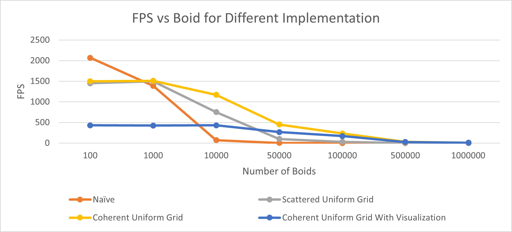
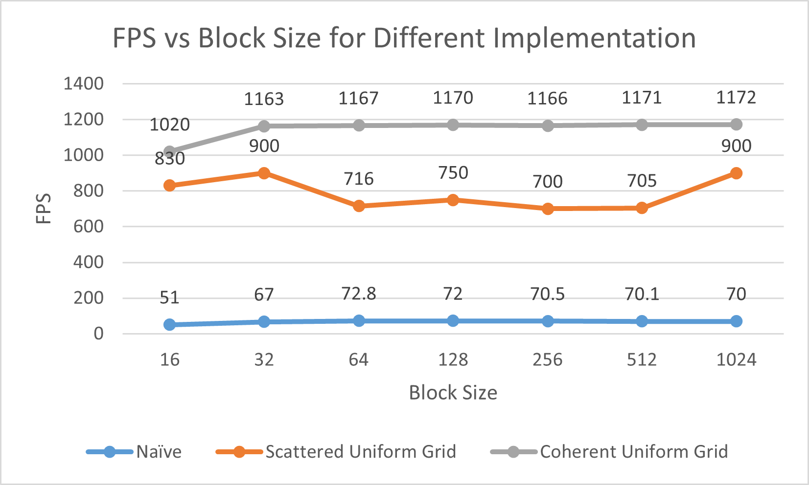

**University of Pennsylvania, CIS 565: GPU Programming and Architecture,
Project 1 - Flocking**

* Yuxuan Zhu
  * [LinkedIn](https://www.linkedin.com/in/andrewyxzhu/)
* Tested on: Windows 10, i7-7700HQ @ 2.80GHz 16GB, GTX 1050 4096MB (Personal Laptop)

**Demo**

**Performance Analysis**

The following performance analysis is done by noting down the Frame Per Second(FPS) of each 
program run. Readers should focus on the big trends instead of the detailed numbers since those
fluctuate due to a variety of reasons (e.g. GPU throttling, etc.)

This graph above shows that increasing boid count will almost always decrease the FPS of each program. 
This is expected since increasing boid count directly increases the amount of computation required. 
The more the computation, the lower the FPS. One interesting fact to note is that the FPS of the coherent
uniform grid simulation with visualization remains constant when boid count is less than 10000, 
but is lower compared to the same simulation without visualization. One hypothesis is that the visualization was
the bottleneck when boid counts are lower than 10000. Another interesting fact is that the naive method is faster 
when there are only 100 boids. This could be because there is less overhead compared to uniform grid search. 
We can see that the FPS of coherent uniform grid is higher than scattered uniform grid, 
which is higher than the naive method in most cases. This is a direct proof that optimizing 
algorithm improves program run time. 

This graph above is obtained by keeping boid count constant at 10000 and varying block size. The maximum block size is 1024, which is
set by the GPU. The graph shows that increasing block size does not seem to affect FPS significantly for the naive method and the coherent uniform grid method. 
This is reasonable because changing the block size does not reduce or increase the total amount of computation required for the boid simulation. 
The only difference is how the threads are scheduled to execute on the GPU. For the scattered uniform grid method, the FPS
peaks at blocksize of 32 and 1024. I don't have a good explanation execept that the combination of boid count and block size enables
the program to fully saturate the computational resource of the GPU.

The program experenced significant performance improvement when I changed from scattered uniform grid to coherent uniform grid.
I did not expect this at first since coherent uniform grid involves an extra shuffling step for the velocity and position buffer.
This performance improvement suggests that the run time improvement due to contiguous memory access outweighs the cost of an extra
shuffling step.

When the grid size is reduced to the length of the search radius, the performance improved for large boid counts. The 
performance difference for small boid count is neglible. One hypothesis is that even though the program
needs to check 27 grids compared to 8 grids, the overall search volume became smaller. 
27 * 1 * 1 = 27 < 8 * 2 * 2 = 32. So the number of potential neighbors is further culled, resulting in faster run time.
