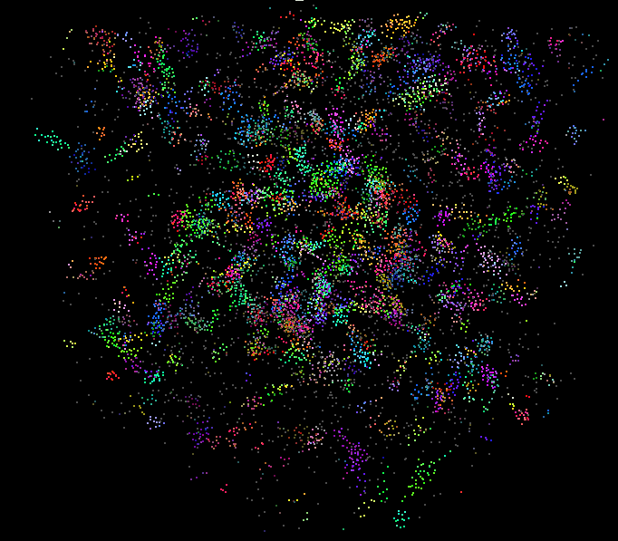
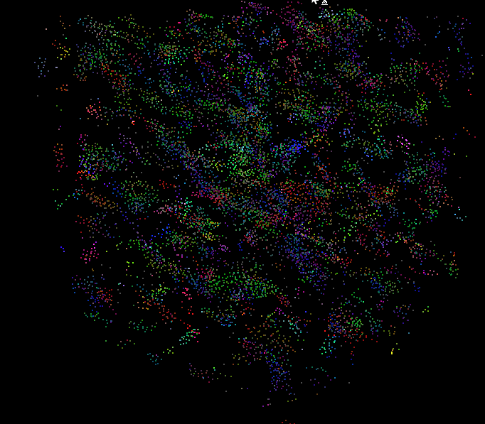
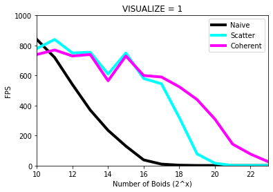
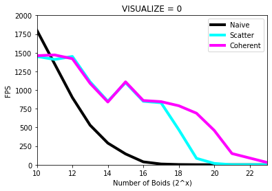
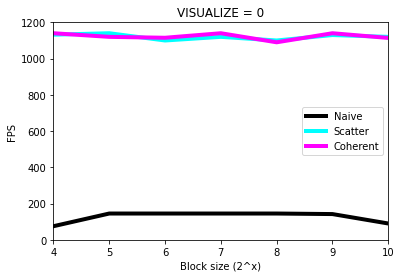

**University of Pennsylvania, CIS 565: GPU Programming and Architecture**
# Project 1 - Flocking

* Jonas Oppenheim ([LinkedIn](https://www.linkedin.com/in/jonasoppenheim/), [GitHub](https://github.com/oppenheimj/), [personal](http://www.jonasoppenheim.com/))
* Tested on: Windows 10, Ryzen 9 5950x, 32GB, RTX 3080 (personal machine)

## Introduction
The purpose of this assignment was to introduce some basic concepts in GPU Programming by having us implement [Boids](https://en.wikipedia.org/wiki/Boids), which is a simulation of flocking behavior. The 16 August 2021 commit titled "Update for Fall 2021" shows where we started and `INSTRUCTIONS.md` shows the instructions we followed. The rest of this README provides a basic performance analysis, answers to some assignment questions, and my concluding thoughts.

What follows are three gifs showing how the simulation behaved using three different approaches. The first gif shows the result of a naive O(n^2) approach where each boid considers every other boid when updating its own velocity. The second and third gifs show the result of using a fancy spatial partitioning data structure called a _uniform spatial grid_. The implementation underlying the third gif takes advantage of spatial locality in memory, which is why it is faster than the second gif. For quantitative results, see the _Performance analysis_ section.

**Naive O(n^2) approach**

**Scattered spatial grid**

**Coherent spatial grid**

## Performance analysis

The following three graphs provide a quantitative analysis of the approaches.

This first two graphs show how the framerate changes as the number of Boids increases, with and without visualization. As expected, the naive O(n^2) approach tanks well before do the spacial partitioning approaches. The memory scattered (cyan) and efficient (fuchsia) approaches perform comparably in the beginning and then the coherent approach wins in the end, as expected.

The most surprising thing about these results is the odd jump at 2^15=32768 Boids. Either 2^14 is abnormally low or 2^15 is abnormally high. This peculiar pattern appears in both the visualized and nonvisualized plots. At this point, I can only speculate that this is casued by something about the block size (128) or these particular numbers of Boids and the archicture of the 3080.

The final plot showing FPS against block size is unremarkable. My takeaway is that for certain graphics cards and certain use cases, there is a goldilox zone of block size. Perhaps if I tested with more Boids, then there would have been a discernable difference between the two spacial partitioning approaches.

I was able to run 2^23 ~= 8 million Boids at 26 fps, visualized. I'm guessing that has more to do with my hardware and less to do with my code :)

## Questions
- **For each implementation, how does changing the number of boids affect performance? Why do you think this is?** The number of Boids can be thought of as the "problem size," $n$, in this simulation. There is a strange edge case seen above where 2^15 Boids performs better than did 2^14, but the clear trend is that increasing the number of Boids decreases performance. More boids == more processing == more time.
- **For each implementation, how does changing the block count and block size affect performance? Why do you think this is?** This is a tough one. The last plot in the _Performance analysis_ section suggests that its possible to suffer from a block size that is too small or too big. And there is a tradeoff between block size and block count. I would speculate that the right choice of block size and block count is _highly_ dependent on the specific application. Some applications might have more different kernels trying to run at the same time and may benefit from smaller blocks that can easily be swapped in and out. Other applications might use fewer kernels but require more threads. I hope to better understand this tradeoff as the course progresses.
- **For the coherent uniform grid: did you experience any performance improvements with the more coherent uniform grid? Was this the outcome you expected? Why or why not?** The scattered uniform grid maybe _slightly_ outperforms the coherent uniform grid in the beginning, just because of the extra overhead of generating additional arays, but the coherent approach is without question more efficient in the long run. This was the outcome I expected in part because `INTRODUCTION.md` eluded, and also because it makes sense since we are taking advantage of spacial locality in memory.
- **Did changing cell width and checking 27 vs 8 neighboring cells affect performance? Why or why not? Be careful: it is insufficient (and possibly incorrect) to say that 27-cell is slower simply because there are more cells to check!** There is a tradeoff between the 27 vs 8 neighboring cell approaches. With 8 cells, each cell is twice as wide as the max neighbor distance, and so the total volume--and by extension, the number of Boids to check--is greater. On the other hand, there is a tiny bit more overhead from checking more cells. On balance, I believe that checking 27 cells with cell with equal to the max neighbor distance is faster, especially as the number of Boids increases. Checking fewer Boids should speed things up, and the overhead of 21 more iterations in a for loop seems insignificant.

## Concluding thoughts
- The most optimized code is not human-readable. The most readable code is often not particularly performant. A personal goal of mine in this course is to gain a solid understanding of what makes GPU code run efficiently so that I can strike a balance between performance and readability.
- This felt like a great first assignment. I was pleased with what was implemented already and what was left to us. It allowed us to focus on some really important stuff like kernel functions and helper functions and how to write efficient code. This seems like a great introduction to the power of GPU programming.
- Nsight feels overwhelming. It is obviously a powerful and useful tool. I think that once I have a better sense for the fundamentals (memory management, grid and block sizes, writing GPU-efficient code), I'll be in a better position to understand and take advantage of all the features.

**A particularly beautiful result with 2^16=65536 Boids**
