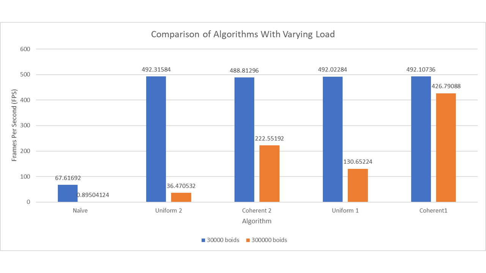
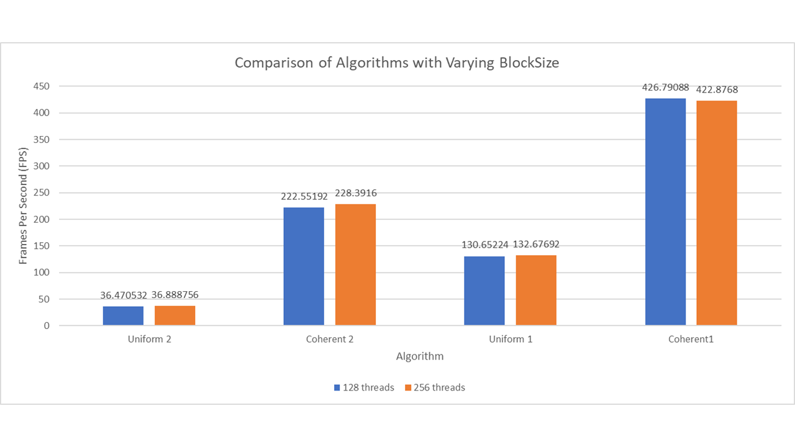

**University of Pennsylvania, CIS 565: GPU Programming and Architecture,
Project 1 - Flocking**

* Stephen Lee
  * [LinkedIn](https://www.linkedin.com/in/stephen-lee-bb5a40163/)
* Tested on: Windows 10, i7-9750H @2.60GHz, RTX 2060 6GB (personal laptop)

# Project Goals
This project was an investigation on the performance implications of several algorithms to simulate the movement of Boid particles with some slight adaptations from [Conrad Parker's](http://www.vergenet.net/~conrad/boids/pseudocode.html) notes. More information on this can be found [here](INSTRUCTION.md). The project encompassed implementing and testing three algorithms: a naive implenetation, an algorithmic optimizationt to reduce the search space, and finally code optimizations to reduce the number of memory accesses.
 
# Boid Basics
Boids are meant to imitate the flocking behaviors of migrating birds or schools of fish. As such, boid move around in this simulation according to these three rules:

1) Boids try to fly towards the center of mass of neighboring voids.
2) Boids try to keep a small distance away from other objects (this includes other boids)
3) Boids try to match the velocity of nearby boids.

The application of these rules lends itself to a high-degree of parallelization, thus they have been implemented across threads on GPU cores. The pseudocode for implementing these rules was provided in the [instructions](INSTRUCTION.md).

Early on in execution the boids are scattered randomly throughout the space

As the simulation progresses, boids begin to travel in flocks with their neighbors forming groups

This is how the boids look moving around in their flocks

## Naive Implementation
The algorithm implemented for boid simulation involved naively checking all the other boids in the simulation to determine how each boid should change its velocity. This is highly inefficient since boids are only affect by boids that are within a close proximity, thus most boids in the simulation that are being checked using this implementation do not contribute anything.

## Uniform Grids
In this algorithm for boid simulation we fix the issue discussed in the Naive Implementation where we are checking many boids that have no contribution to velocity changes for every boid. This algorithm leverages this fact and shrinks the search space for boids down to a more localized area around the current boid so that we only need to check boids that are nearby.

We accomplish this by establishing a uniform grid of cells across the simulation space, breaking it up into cubic regions. Now for each boid we must determine which grid cell contains the boid. Once this information is gathered, we can leverage it by performing a key value sort with the newly computed cells as keys and an array of indices of boids as values. As a final preprocessing step, we can walk through the newly sorted grid cell value array to compute starting and ending positions for each cell that is useful when performing the boid computations.

Finally, we can use all this information that we have computed to shrink our search space down. This is accomplished by only checking boids who belong to grid cells neighboring our current cell rather than having to check every boid in all of the cells which we did in the naive implementatoin. We can accompish this by determining where in the grid cell the boid is relative to the center of the grid cell, and checking the neighboring grid cells in that direction. 

## Memory Coherency
While shrinking the search space down to only check boids that could reasonably affect the velocity of each boid results in a significant performance increase, one issue with how this was implemented was that we use a middleman array to keep track of where we are storing position and velocity data after performing our key value sort. This is problematic, because using this middleman array to access position and velocity requires many redirections and random accesses in memory. This final optimization accounts for this issue by cutting out this middleman array so that position and velocity data are arranged sequentially after performing the key value sort to minimize redirections and random accesses.

# Performance Analysis
Frames per second (FPS) was used as the primary metric to analyze the performance of each of these algorithms. Frame rate was uncapped and with v-sync off, meaning that in each case, the simulation was running at full speed.

I added some code to [main.cpp](src/main.cpp) to easily log this information to the terminal in 1 second intervals. FPS values were then averaged over a 25 second execution.

Simulations were ran with a few different parameters tweaked that are visible in the bar graph above. First, we account for the three primary algorithms implemented in this project: naive, uniform, and coherent. For uniform and coherent, further investigation was made based on whether the grid was defined to have grid cell widths that were twice the maximum possible distance a boid could be affected by a neighbor or simply this maximum possible distance. These are denoted with suffixes 2 and 1 respectively. The different colored bars represent the different testing loads applied to the simulations, with blue being a load of 30000 boids and orange ten times that value at 300000 boids.

It is immediately apparent that the naive implementation performs very poorly. With the lighter 30000 boid load, it could only output a small fraction of the other two methods and the heavier load hardly even ran. The lighter load however failed to produce conclusive distinctions between the standard uniform grid approach and the coherent memory optimization in both grid cell widths tested.
The lack of separation in perfomance under the lighter load is likely due to some bottleneck that is not reliant on the computation only performance of the algorithm. Probably some hardware limitation that data cannot travel any faster to be processed.

With the heaver 300000 boid load however, we begin to see much more interesting and promising results. The coherent memory access approach is far superior to the standard uniform grid method, and we can also see that reducing the cell width to be one times the maximum distance a boid could affect its neighbor also markedly improved performance.

Further investigation was done on this 300000 boid load case where the number of threads in a block (BlockSize) was doubled to be 256 rather than 128. It was found that this did not have much impact however.

# Questions
1) Increasing the number of boids decreased the performance of the simulation for all of the algorithms tested. Adding more boids to the simulation means more boids have to be checked, meaning more computation has to be done for each boid. This increased computation time is likely what causes this performacne dip.
2) Chaning the block count and block size did not really affect performance at all. This can be attributed to the fact that changing these values only changes how the kernels get divided up across the SMs on the GPU. Each SM can only run a single warp at a time, so this does not actually change the number of operations being done at a time, it just distributes them differently.
3) As discussed in performance analysis, the coherent uniform grid demonstrated great performance increases for heavier loads of boids. We likely did not see any change in performance for the lighter load because we are bottlenecked by something other than computational power, and experienced a great performance increase with a heavier load since we reduce costly redirections and random accesses in memory. This was the outcome that I expected for these exact reasons.
4) Changing the cell width and checking 27 neighors vs 8 neighors improved performance. While on the surface it might seem that checking more cells would be more costly, but with a closer look we see that the volume represnted by those 27 cells is in fact smaller than that of the 8 cells. Since we are dealing with unit lengths in the 27 cell case, and double unit lengths in the 8 cell case, the side length of the cube we are checking is only 3 units vs 4 units for the 8 cell case. Since we are checking a smaller volume for boids, it is likely that we will run into fewer boids to check, thus decreasing the amount of computation that needs to be done sequentially for each boid.