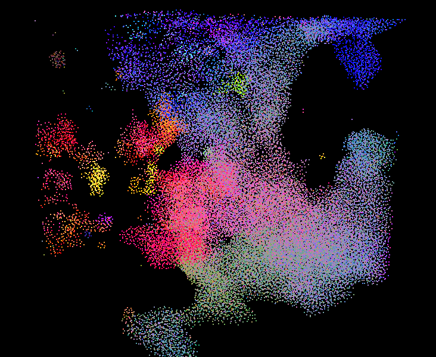
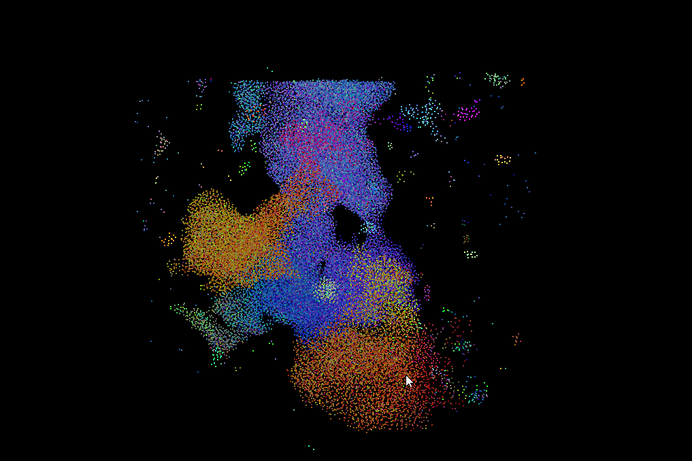
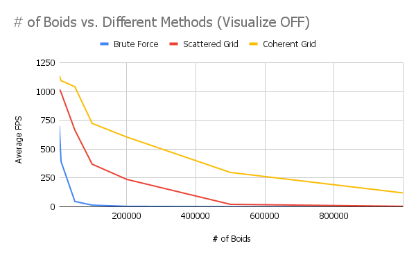
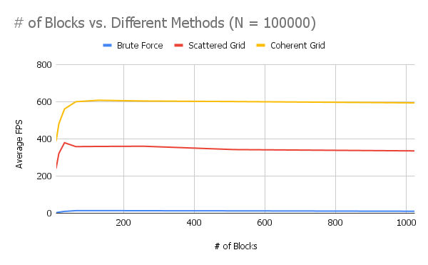
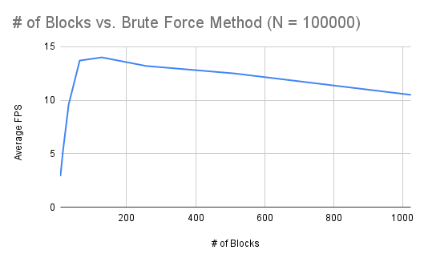

**University of Pennsylvania, CIS 565: GPU Programming and Architecture,
Project 1 - Flocking**

* Wayne Wu
  * [LinkedIn](https://www.linkedin.com/in/wayne-wu/), [Personal Website](https://www.wuwayne.com/)
* Tested on: Windows 10, AMD Ryzen 5 5600X @ 3.70GHz 32GB, RTX 3070 8GB (personal)

## Screenshots

## Performance Analysis

Figure 1: Number of Boids vs. Different Methods (Visualize ON)

Figure 2: Number of Boids vs. Different Methods (Visualize OFF)

Figure 3: Number of Blocks vs. Different Methods (N = 100000)

Figure 4: Number of Blocks vs. Brute Force Method (N = 100000)

## Questions

**For each implementation, how does changing the number of boids affect performance? Why do you think this is?**

For all implementations, increasing the number of boids decreases the average FPS.
This is expected given that as we scale up the number, it will exceed the number of threads that can be run in parallel at one time.
When we turn off the visualization, we can see that it increases the performance at lower number of boids.
However, it does not matter as much when we increase the number of boids since at that point the computation for OpenGL draw 
is too insignificant for the overall performance cost.

**For each implementation, how does changing the block count and block size affect performance? Why do you think this is?**

The block count and block size do not significantly affect the performance. For each implemntation, the average FPS stays roughly the same. This is expected as it simply configures how threads are grouped together, and does not affect the actual thread units that can be run in parallel. Therefore the overall performance will stay the same. There is, however, an optimal block size that can be configured to squeeze out a tiny bit of performance (Figure 4).

**For the coherent uniform grid: did you experience any performance improvements with the more coherent uniform grid? Was this the outcome you expected? Why or why not?**

The coherent uniform grid significantly improved the performance which is unexpected coming from traditional CPU-based programming. To have a coherent uniform grid, two new buffers and a new kernel were introduced which I initially thought would be more costly than removing the need to access the arrayIndices buffer. This turned out to be false, which proves that GPU is 
definitely more costly at accessing shared memory.

**Did changing cell width and checking 27 vs 8 neighboring cells affect performance? Why or why not?**

It did not significantly affect the performance.
While it is true that we're traverseing more cells, each cell is now smaller as the cell width is the search radius instead of, previously, two times the search radius. As such, on average, the number of points inside each cell will now be smaller, and thus the overall iteration count does not change significantly.