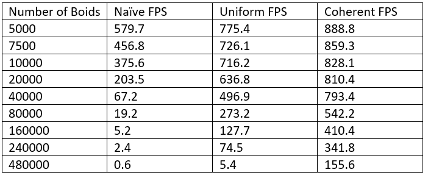
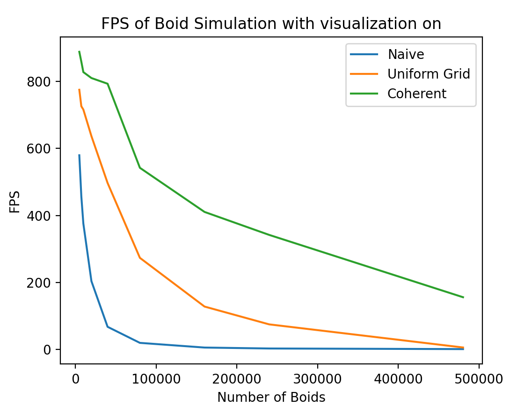
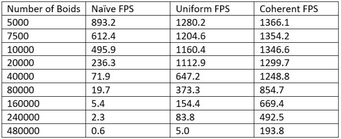
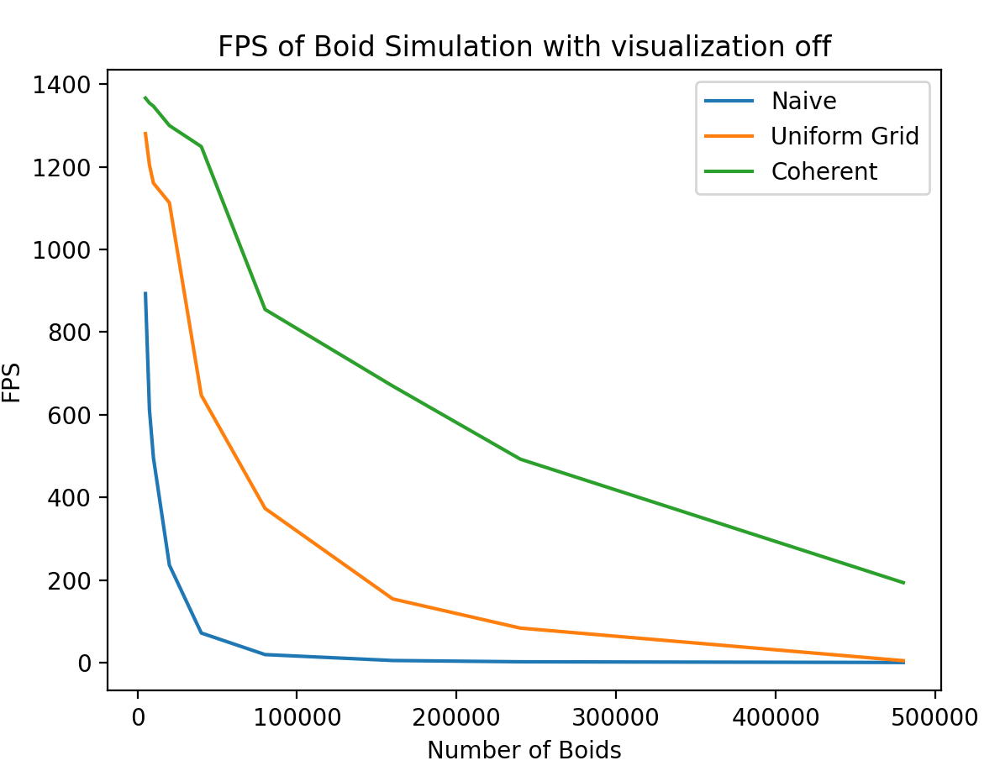
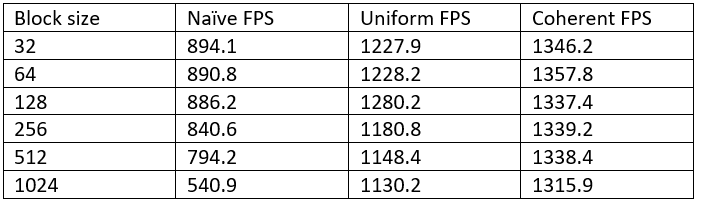
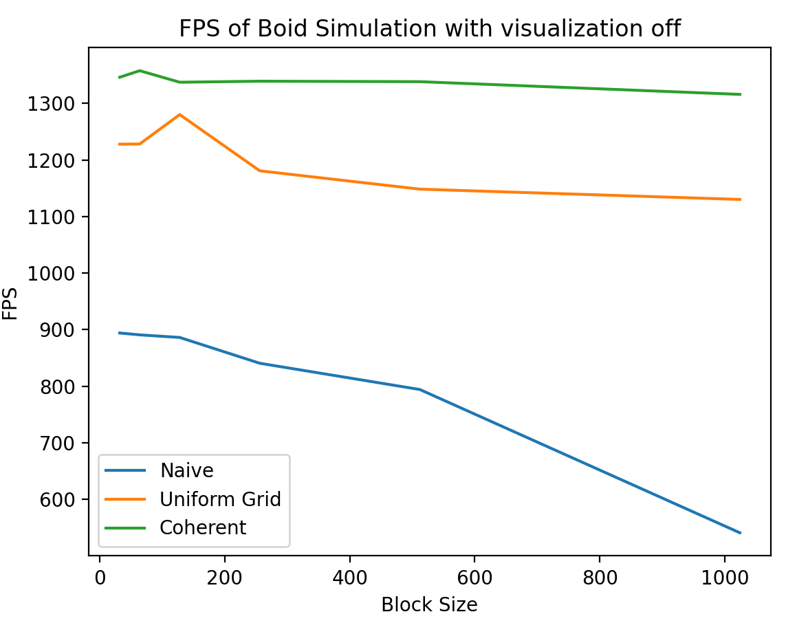
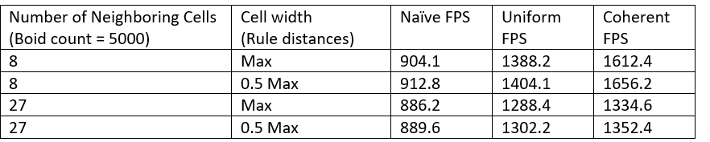

**University of Pennsylvania, CIS 565: GPU Programming and Architecture,
Project 1 -  Flocking**

* Nuofan Xu
* Tested on: Windows 10, AMD Ryzen 3800x @ 3.9Hz 2x16GB RAM, RTX 2080 Super 8GB

### Overview

###### (Run on RTX 2080 Super with 10000 boids, recorded as GIF at low fps due to file size limitations of github)

This project served as an introduction to CUDA kernels and performance analysis. It is implemented using the Reynolds Boids algorithm in parallel on the GPU.

Boids is a crowd simulation algorithm developed by Craig Reynolds in 1986 which is modeled after the flocking behaviors exibited by birds and fish. The most basic version of the algorithm operates on three rules:
* Cohesion: Boids try to move towards the perceived center of mass of other boids around them.
* Alignment: Boids tend to steer in the direction of the perceived average movement of other boids around them.
* Separation: Boids try to keep some amount of distance between them and other boids.

### Three implementations:
#### 1. Naive Approach

The naive approach for computing the new positions and velocities for the boids is to check all the boids against the other boids excluding itself and apply the three rules described above. This is extremely slow with a time complexity of O(N^2) as it needs to scan through all the boids to calculate the position and velocity. 

A simple way to implement this in CUDA is to have one thread for each boid. Each thread would loop over the entire position and velocity buffers (skipping itself) and compute a new velocity for that boid. Then, another CUDA kernel would apply the position update using the new velocity data.

#### 2. Uniform Scattered Grid

A spatial data structure can greately improve performance for the algorithm. If we reduce the number of boids each boid needs to check against, we can decrease the amount of work each thread needs to do. We set a certain search radius, and only apply the three rules within it. We choose to impose an uniformly spaced grid on the boids, which allows us to perform a very efficient neighbor search and only check a very limited number of boids. We choose our uniform grid cell width to be twice the maximum search radius. This makes it so that at most, a boid may be influenced by other boids in the 8 cells directly around it.

To create the "grid" we create an additional CUDA kernel which fills a buffer with respective grid cell indices. A parallel sorting algorithm, thrust::sort_by_key, is then used to sort boid indices by their corresponding grid cell indices. Furthermore, we store the "start" and "end" indicies for each grid cell in two new buffers by checking for transitions between cells in the sorted grid cell buffer.

Now, instead of checking against all other boids, each thread in our velocity update can determine the boids grid index based on its position; this then allows us to determine the 8 neighboring cells in 3D space, and only apply rules for those boids that have an index between "start" and "end" of a neighboring cell.

#### 3. Uniform Coherent Grid

Pointers to boid data are contiguous in memory, but the boid data they point to are not. We can further speed up the algorithm by making memory accesses to Boid data more coherent. The uniform scattered grid implementation does unecessary hopping and pointer-chasing. Instead of using an additional sorted buffer to find the index into our particle data, we can shuffle the particle data so that it is also sorted by grid cell index. This allows the GPU to load in and cache our position and velocity data for the boids resulting in fewer global memory calls. This small change ends up making signficant performance improvements.

### Performance Analysis

#### Effect of boid count on framerate

Tests were done using a block size of 128 on all three implementations with visualization window on. Verticle sync feature is turned off to avoid capping FPS at 60.

Tests were also done using a block size of 128 on all three implementations with visualization window off.

##### The Naive implementation stops working for >= 480,000 Boids as the CUDA kernels refused to launch with such high boid counts.

As would be expected, as the number of boids increases, all three implementations suffer slowdowns due to the increaing amount of calculations that need to be done, with or without the visulization window. There are some interesting oberservations from those graphs. We can see that using the Uniform Scattered Grid implementation greatly improves performance compared to the naive approach, and then the Uniform Coherent Grid implementation surpasses even that in terms of performance. Intuitively, this makes sense. Uniform Scattered Grid reduces the number of boids that have to be checked against for each boid by setting up a search radius. Uniform Coherent Grid provides coherent memory for boids data, making the memory access faster because of better caching and reduction in the number of calls to global memory. In general, framerate of simulation without visualization is higher, but the trend is the same, and the result converges as the boid count increases (at lower FPS).  

#### Effect of block size on framerate

Tests were done using 5000 boids on all three implementations with visualization window off.

From the graph we can see that block size barely affects Uniform Coherent Grid implementation. Generally speaking, the increase of block size decreases the performance of Boid simulation. This might be because smaller blocks mean a larger number of blocks. With increasing number of warps in its own block, we gradually lose the performance benefits of shared memory within a block and instead need to allocate memory for each of our very many blocks.

The blocksize doesn't affect Uniform Scattered and Uniform Coherent Grid implementations as much as it affects Naive implementation. My guess is that there are more memory accesses from different blocks in Naive approach and the performance benefit of accessing shared memory is weighted less. 

#### Effect of changing search radius (26/8 neighboring cells) and grid cell size

As can be seen in the table above, an increase in the number of neighboring grid cells we check results in a lower framerate, same as an increase in cell width. The former is easy to understand - the more boids we have to check against the current boid, the more calculation and memory accesses that need to be done. The latter is because that more boids will likely be covered in those bigger cells. By cutting cell width to half and checking 26 neighboring cells, we essentially just increase the overhead for maintaining the grid without a significant reduction in the number of boids we check. It is possible to achieve a better framerate by increasing 'cell width' and decreasing 'the number of neighboring grid cells that have to be checked', although it is achieved mainly by reducing the number of boids to check (less memory accesses and calcualtions).

### Feedback

Any feedback on errors in the above analysis or any other places is appreciated.