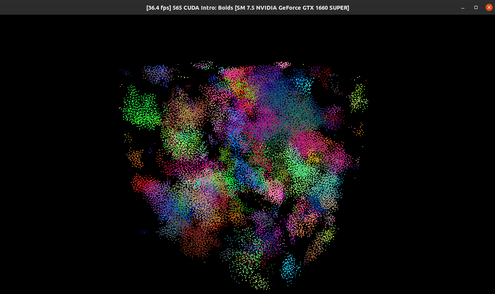
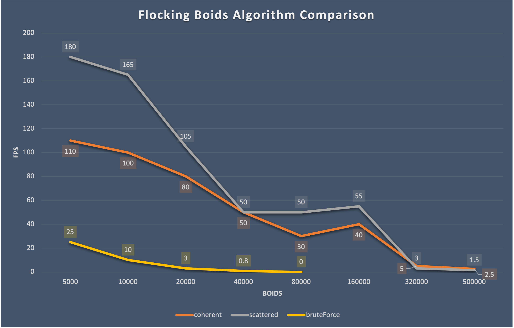
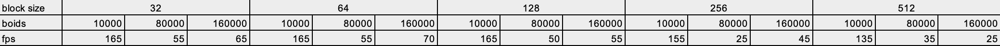

**University of Pennsylvania, CIS 565: GPU Programming and Architecture,
Project 1 - Flocking**

* Matt Elser
  * [LinkedIn](https://www.linkedin.com/in/matt-elser-97b8151ba/)
* Tested on: Ubuntu 20.04, i3-10100F @ 3.6GHz 16GB, GeForce 1660 Super 6GB

### Boids Flocking Implementation

### Performance Analysis

Data for this plot was gathered from repeated runs of the three algorithms with visualization turned off.
Repeated FPS measurements were taken at 5 seconds into each run, and rounded to the nearest 5 FPS (with 
the exception of the notably low FPS runs at the max of each algorithm).

Observations of note based on the above plot:
#### 1. Brute force is the least performant by a large margin, and scales poorly.
   The brute force algorithm when not run parallel would have quadratic complexity, and parallelisation
   can only improve this so much.
#### 2. Coherent does not out perform scattered grid, indicating a flaw in the algorithm. 
   The entire purpose of the coherent neighbor search within the uniform grid is to arrange as much 
as possible into contiguous memory for efficient io on the SMs, avoiding as much as possible the need 
to transfer memory to/from slower sources. Fixing this on time was derailed by a pernicious bug which 
prevented the algorithm from working entirely, so it has been noted in "Areas for Improvement" below.
#### 3. FPS decreases over time for uniform grid algorithms
   As the simulation runs for both uniform grid algorithms, they get slower. This makes sense: as time 
   goes on, more boids flock and therefore more neighbors need to be checked. 
#### 4. Counterintuitively, there is a repeatable increase in performance from 8,000 boids to 16,000
   This could suggest a possibility for optimization of parameters such as block size, as explored below.

### Block Size Comparison

Using only the scattered uniform grid algorithm, timings were captured similarly to the algorithm 
comparison chart: fps was taken repeatedly at 5s from simulation start and rounded to the nearest 5fps. 
All block sizes tested show the same behavior from observation #4: simulation speed increases from 
80,000 boids to 160,000. Further digging would be aided by finer grained timing, such as seeing how 
much time is spent at the sorting stage, and whether block size affects this. 

### Areas for Improvement
- 🔲 The code is not as tidy as I would like. 
- 🔲 As noted in the performance analysis, the fact that the coherent grid implementation 
runs notably slower than the scattered grid implies that memory is not being read continguously.
- 🔲 Finer grained timing, e.x. how long sorting takes 
- ✅ In the course of writing the performance analysis, additional shuffles were removed from the 
coherent grid implementation. Initially, position/velocity arrays were kept in alignment with the 
neighboring grids by a shuffling step, then unshuffling for assignment and continuity between 
timesteps. This required multiple `copy` and `sortByKey` calls. Continuity and assigment do not 
require consistancy between timesteps though, only consistancy with eachother. Removing these 
shuffles yielded the performance described above, a ~10fps (~33%) speed increase at 50,000 boids 
from the previous version.