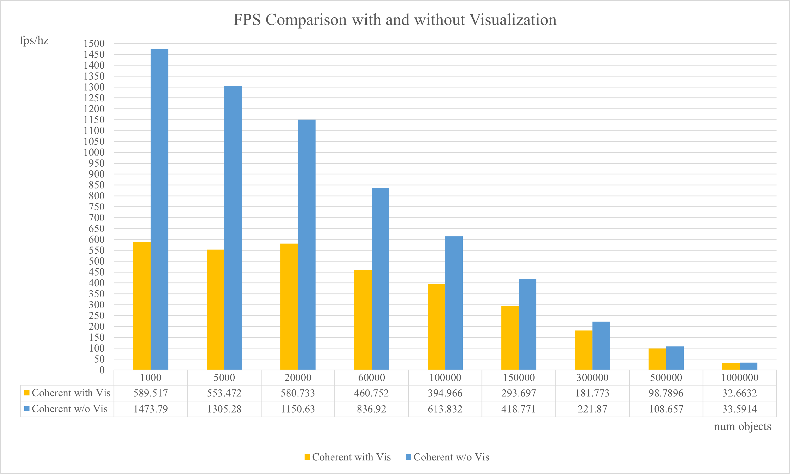
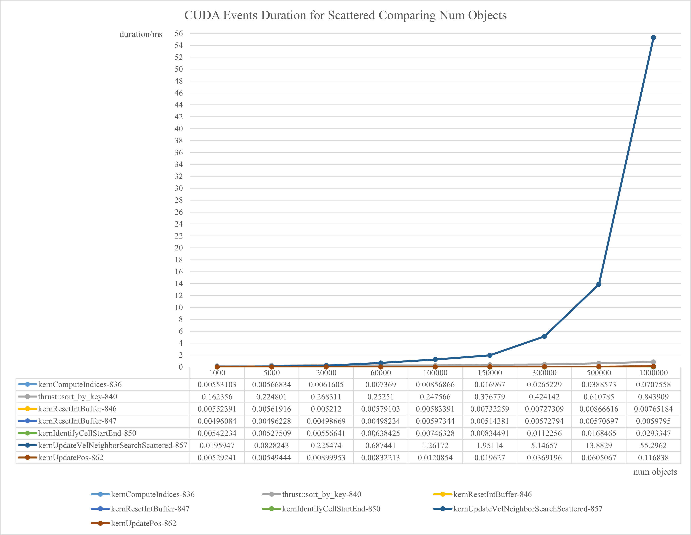

**University of Pennsylvania, CIS 565: GPU Programming and Architecture,
Project 1 - Flocking**

* Xuntong Liang
  * [LinkedIn](https://www.linkedin.com/in/xuntong-liang-406429181/), [GitHub](https://github.com/PacosLelouch), [twitter](https://twitter.com/XTL90234545).
* Tested on: Windows 10, i7-10750H @ 2.60GHz 16GB, RTX 2070 Super with Max-Q 8192MB

## Play Around

First of all, let's play with 5K boids.

### Play Around with 5K Boids

I opened V-sync to capture the result with 5K boids. Otherwise the boids would move in crazy speed due to the extremely high frame rate.

After a while, some boids went together and became clusters.

### Play Around with 60K Boids

The result with 60K boids also consists of the process of aggregating clusters.

It seems like pouring some paints :sweat_drops:.

### Play Around with 1M Boids

I think the result is not so pretty because it is too crowdy! However, it turns out to run at a good frame rate even with visualization.

## Tasks

I manage to implement all the required method to simulate the boids flocking:

1. <b>Naive</b>: Naively traverse all the other boids.
2. <b>Scattered</b>: Create a uniform grid for searching.
3. <b>Coherent</b>: Based on the uniform grid, align the scattered velocity and position attributes in memory coherently to improve the memory access.

Also, I optimize the grid loop for adaptable neighbor searching in different grid cell width.

Shared memory is not implemented.

## Questions about Performance Analysis

First of all, there are some questions and answers about the performance:

* Q1: For each implementation, how does changing the number of boids affect
  performance? Why do you think this is?

* A1: Commonly, increasing the number of boids would increase the duration of each frame, thus decrease the frame rate, because this makes the average number of the neighbors of each boid increase, which increase the duration of updating velocity. For the `Scattered` and `Coherent` method, the time of sorting is also affected. 

  

* Q2: For each implementation, how does changing the block count and block size
  affect performance? Why do you think this is?

* A2: When the number of boids is small (for example, 5000), it does not affect too much because the main cost is sorting, which is independent of the block size. When the number of boids increase, the main cost gradually becomes updating velocity. When updating velocity, there exists a latency issue of accessing the memory. In this situation, containing more wraps in each block may be able to hide the latency, thus to increase the performance.

  

* Q3: For the coherent uniform grid: did you experience any performance improvements
  with the more coherent uniform grid? Was this the outcome you expected?
  Why or why not?

* A3: The more boids to simulate, the more improvements I experience. In my opinion, maintaining coherent uniform grids needs extra reshuffle operations, but access the memory in a better way. When the number of boids is small, the performance improvements do not appear because of the trade-off. However, when the number of boids become larger, the improvements become significant, since the cost of reshuffle operations increases a little but the strategy of memory access becomes much more important.

  

* Q4: Did changing cell width and checking 27 vs 8 neighboring cells affect performance?
  Why or why not? Be careful: it is insufficient (and possibly incorrect) to say
  that 27-cell is slower simply because there are more cells to check!

* A4: It does affect performance. Actually, checking 27 neighboring cells with 5.0 in width performs better than checking 8 neighboring cells with 10.0 in width. I think the performance improvements come from the fewer neighboring boids to consider, so it appears better when the number of boids is large. However, when the number of boids is small, it seems not so crowdy that the number of neighborhoods is not affected too much. Moreover, smaller grid cell width causes more grid cells, and it turns out to increase the cost of resetting `gridCellStartIndices` and `gridCellEndIndices`. It may cause another trade-off. 

See [further analysis](##performance-analysis).

## Performance Analysis

I recorded the data of each run, starting at the frame 512 and recording the 1024 consecutive frames. Then average the data per frame. 

First of all, analyze the performance with increasing number of boids for naive, scattered uniform grid, and coherent uniform grid, with and without visualization. These are run with the default settings of the block size and the neighboring search. 

### Performance with Increasing Number of Boids

First check the framerate. Because the framerate of Naive is too low when the number of boids is large, I did not record the performance since I suppose the result is useless. 

It turns out that the performance is affected much with the number of boids. Also, the performance increases rapidly with uniform grid, and the performance is even better with coherent boids data in most cases. As the answer of [questions](#questions-about-performance-analysis) describes, I cannot tell the performance is better with coherent boids data when the number of boids is small. The duration of each event is needed.

Then check the event duration:

With increasing boid count, the cost of `kernUpdateVel` increases rapidly, and the cost of `thrust::sort_by_key` is also significant. 

The results are the same with visualization:

We can see that `kernUpdateVelNeighborSearchCoherent` is faster than `kernUpdateVelNeighborSearchScattered` in all cases, but it needs to reshuffle to maintain the coherent boids data, as the answer of [questions](#questions-about-performance-analysis) describes. As a result, `Coherent` affects little in cases with very few boids, but affects much in cases with more boids. 

### Performance with Different Block Size

Changing the block size affects the underlying behaviors of the GPU. I analyzed with `Coherent` method and 8 neighboring cells, and cases with 5K boids, 100K boids, and 1M boids respectively. Framerates are shown below.

I guess that the latency issue is bigger when the number of boids is larger, so the performance increases monotonically with 1M boids, but it does not happen with 100K boids and 5K boids. 

Further analysis on each event shows more information.

As the answer of [questions](#questions-about-performance-analysis) describes, when the number of boids is small, the main cost comes from `thrust::sort_by_key`, which is not controlled by block size, so changing the block size rarely affects the performance. When the number of boids is large, the main cost comes from `kernUpdateVelNeighborSearchCoherent`, and it produces much latency of memory access. 

### Performance with Different Grid Cell Width

When changing grid cell width, the neighboring cells may change as well. I analyzed with `Coherent` method and 128 threads per block, and cases with 5K boids, 100K boids, and 1M boids respectively. Framerates are shown below.

It turns out that in 5K boids case, the default setting performs better. In 100K and 1M cases, 5.0 width with 27 neighboring cells performs better. It can run over 100 hz without visualization even with 1M boids.

I analyzed the duration of CUDA events and found that `kernUpdateVelNeighborSearchCoherent` and `kernResetIntBuffer` for each cell are affected much. Here are the statistic of them.

The duration of `kernUpdateVelNeighborSearchCoherent` shows that `5.0&27` is always the best setting, while in 5K boid case, the duration of `5.0&27` is nearly equal to the duration of `10.0&8`.

So what about `kernResetIntBuffer`?

Generally, the duration of `kernResetIntBuffer` for each cell decreases when the grid cell width increases. I guess that even though this kernel should be execute parallel, the very large count of grid cell really matters because of the latency of starting a wrap, accessing global memory, etc. And because the cost of `kernResetIntBuffer` with `5.0&27` is higher than that with `10.0&8`, the performance of `5.0&27` is not better than the performance of `10.0&8` in 5K boids case is reasonable. 

- Raw data of performance analysis can be found in this repository.

