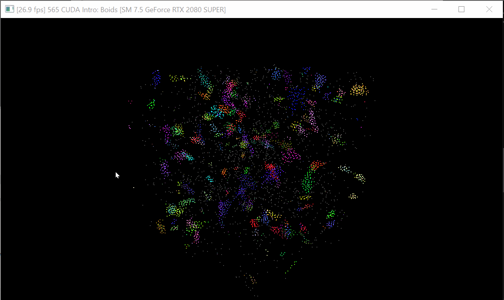

**University of Pennsylvania, CIS 565: GPU Programming and Architecture,
Project 1 - Flocking**

* Nithin Pranesh
  * Here are some links to connect with me: [LinkedIn](https://www.linkedin.com/in/nithin-pranesh), [YouTube](https://www.youtube.com/channel/UCAQwYrQblfN8qeDW28KkH7g/featured), [Twitter](https://twitter.com/NithinPranesh1).
* Tested on: XPS 15 7590, Windows 20H2, i7-9750H @ 2.60GHz 22GB, GTX 1650.

### Project 1: CUDA Flocking

### Overview

This is a simulation of the flocking behavior of an idealized species referred to as "Boids". While there are many other behavioral forces that could be added, this simulation only considers cohesion, spacing, and momentum. More precisely, an individual boid attempts to stick near the rest of the flock, maintain a small distance from other boids to avoid collision, and maintain a similar velocity to the local flock. 

### Questions

1) _For each implementation, how does changing the number of boids affect
performance? Why do you think this is?_

- Naive implementation: The naive implementation has to check all other boids for velocity contributions in order to update the velocity of a single boid. This is the case even if some are obviously too far away to affect the current boid. So increasing the number of boids linearly increases the time it takes.

- Scattered uniform grid: The uniform grid implementation takes an extra precomputation sorting step that is gpu-accelerated, but as a result we only need to check a constant number of cells per boid (in our case 8 cells). Each cell may technically have an arbitrary amount of boids out of the total n boids, but in practice, the spacing rule keeps the worst case density still quite low.
Increasing the number of total boids will not increase the local boid density noticeably. This is true up until the entire scene is saturated with boids, at which point the simulation is useless anyhow. Since the runtime complexity of the uniform grid approach is a linear function of the local density, the performance for the velocity calculation practically does not deteriorate with more boids. As the number of boids increases, the overall performance gets worse as a result of the sorting step, cache non-locality, using global memory instead of shared memory, and the limit of gpu core count.

- Coherent uniform grid: The coherent uniform grid appraoch clearly saves all the computation that the normal uniform grid implementation did above. In addition it resolves the cache non-locality we saw since now the position and velocity buffers are reordered by grid cell id during the sorting step. This is so that when we iterate over boids in a cell and in adjacent cells, the retrieved cache line will contain the boid data in the same order that we will be iterating through it. When increasing the number of total boids, the performance will still be bound on the usage of global memory instead of shared memory.

2) _For the coherent uniform grid: did you experience any performance improvements
with the more coherent uniform grid? Was this the outcome you expected?
Why or why not?_
- There did not appear to be a difference in framerate at 50,000 boids when the visuals were enabled, both were hovering around 550 fps. At 70,000 boids with the visualization off the difference was more clear, the uniform grid was struggling at around 8 fps while the coherent uniform grid was comfortably hovering around 290 fps.

3) _Did changing cell width and checking 27 vs 8 neighboring cells affect performance?_
- Using 8 cells (2x2x2 cube) instead of 27 (3x3x3 cube) was slightly faster not necessarily because it was less cells, but because a 3x3x3 cube has 9 disjoint memory segments that need to be fetched while a 2x2x2 cube only has 4 disjoint memory segments. This is determined by looking at which cells in each cube are contiguous with other cells in memory. Then, we need to see how many disjoint groups (each group containing contiguous cells) make up the entire cube. For example, in the 2x2x2 search cube, there are 4 segments of memory that are disjoint from each other, each of which has 2 cells that are adjacent in memory. In the 3x3x3 case, there are 9 disjoint segments with 3 adjacent cells in each segment. 

### Analysis

