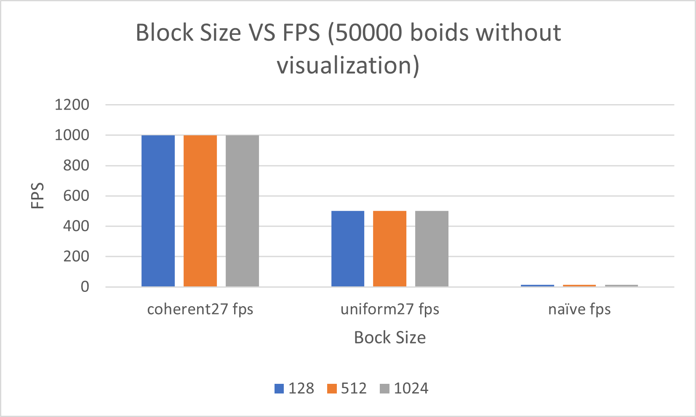

**University of Pennsylvania, CIS 565: GPU Programming and Architecture,
Project 1 - Flocking**

* Yichao Wang
  * [LinkedIn](https://www.linkedin.com/in/wangyic/) etc.
* Tested on: Windows 10 Home 64-bit (10.0, Build 18363)
  * Intel(R) Core(TM) i7-7700HQ CPU @ 2.80GHz (8 CPUs)
  * GeForce GTX 1060	6.1

**Boids Animation**


**Performance Analysis**




From above plots, we can see:

1. For each implementation, as the # of boids increases, the performance descreases. This is because we need to process more data as the # of boids increases.

2. For each implementation, changing of block size does not affect performance. This is because changing of block size does not change the amount of threads we used to process data.

3. The performance improves with the more coherent uniform grid. Because we reduce the random access by eliminating ```dev_particleArrayIndices``` and use contiguous memory by ordering boid's position and velocity in the coherent kernel.

4. Surprisingly, checking 27 neighboring has better performance than checking 8 neighboring. This is because we have many if statements when checking 8 neighboring. The if statements make the branch in warp diverge which results in more run time.
