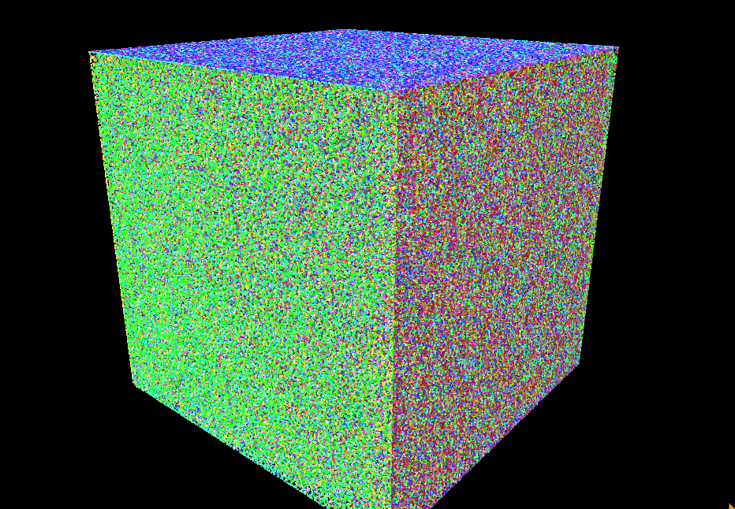

Boids Flocking Simulation
====================

**University of Pennsylvania, CIS 565: GPU Programming and Architecture,
Project 1 - Flocking**

* Bowen Deng
  * [LinkedIn](www.linkedin.com/in/bowen-deng-7dbw13), [twitter](https://twitter.com/7Dbw13)
* Tested on: Windows 10, AMD Ryzen 9 5900HX with Radeon Graphics @ 3.30GHz 16GB, GeForce RTX 3070 Laptop GPU 8GB (Personal Computer)


## Abstract

Flocking simulation based on the Reynolds Boids algorithm, along with two levels of optimization: a uniform grid, and a uniform grid with semi-coherent memory access.


> Simulation for 10000 boids


> Simulation for 100000 boids

In the simulation, particles representing birds or fish (boids) move around the simulation space according to three rules:

1. cohesion - boids move towards the perceived center of mass of their neighbors
2. separation - boids avoid getting to close to their neighbors
3. alignment - boids generally try to move with the same direction and speed as their neighbors

These three rules specify a boid's velocity change in a timestep. Different velocities are rendered with different colors in the simulation.

## Highlights

At most 50 million boids are simulated at the same time with about 0.1 fps. A visualization for 10 million boids is shown as below (visualization for 50 million is hard to see the change).



## Performance Analysis

### Measurement Metric

Besides the provided framerate meter, custom CUDA events are applied to measure only the time of the simulation CUDA kernel. And an average kernel FPS is computed in the following way
```
// display average FPS of every 5 seconds
if (time_elapse >= 5.0f) {
  kernel_fps = frame / time_elapse;
  frame = 0;
  time_elapse = 0;
}
```

Here, `time_elapse` is the total time consumed by just the simulation kernel. For all following experiments presented, the average kernel FPS of the first 5 seconds is chosen as the measurement metric.

To use this kernel FPS instead of the origin FPS display, toggle this macro defined in `src/main.cpp`
```
// toggle for measuring just simulation CUDA kernel
#define KERNEL_FPS 1
```

### Benchmark

The naive neighbor search based on Brute Force is chosen as the benchmark. In this method, each boid simply checks every other boid at every timestep.

For following experiments presented, all parameters are set as default if not mentioned.

### Number of Boids

The framerate drops dramatically as the number of boids grows


This is a natural result since more boids are simulated, more computation GPU needs to perform at each timestep.

### Coherent Uniform Grid

From previous figure, we can see the impressive performance gain given by applying the uniform grid. In addition, the more coherent uniform grid improves the performance further, especially when the number of boids is large (50000 ~ 500000). A possible reason is that coherent uniform grid makes continuous read in memory more efficient due to the buffer mechanism. As the number of boids grows, the number of neighbors of each boid also grows, and so more continuous read is needed. Coherent uniform grid benefits more in this case.

### Visualization

Turning off the visualization improves the framerate, but there is almost no difference for the benchmark and the grid methods with extremely large boids


Possibly, as the number of boids becomes large enough, the computation for their velocities reaches the bottleneck, which makes the computation for visualization relatively not so important.

### Block Size

The framerate seems not affected significantly by the block size. It slightly drops when the block size is very large


With a large block size, the performance may be hurt by issues of the scheduler. The computation may not be parallelized well.

### Cell Width

Halving the cell width in grid methods, which makes it equal to the maximal search range of each boid, improves the framerate.


The original cell width is as twice as the maximal search range of each boid. Halving it means that we should check 27 neighbors for each boid now. However, it is not trivial that the performance will drop. This is because each cell gets smaller and contains fewer boids. As a result, the performance improves a little bit instead.

Use half cell width by toggling this macro defined in `src/kernel.cu`
```
// toggle for halving cell width
#define HALF_CELL_WIDTH 1
```

## Extra Credit

### Grid-Looping Optimization

Instead of hard-coding a search of the designated area (8 or 27 neighbors), this optimization limits the search area based on the grid cells that have any aspect of them within the maximal search range of each boid.

To enable this feature, toggle this macro defined in `src/kernel.cu`

```
// toggle for grid-looping optimization
#define GRID_LOOPING 1
```

The performance test shows an improvement by applying this optimization

