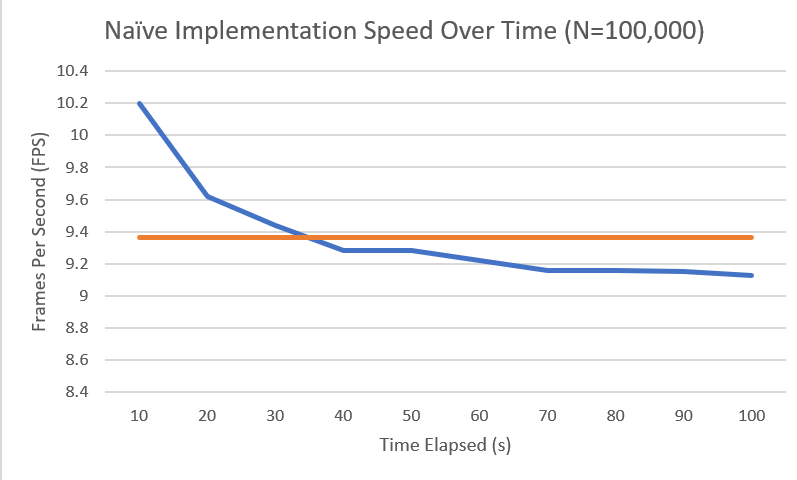

**University of Pennsylvania, CIS 565: GPU Programming and Architecture,
Project 1 - Flocking**

* Anthony Mansur
  * https://www.linkedin.com/in/anthony-mansur-ab3719125/
* Tested on: Windows 10, AMD Ryzen 5 3600, Geforce RTX 2060 Super (personal)

Submission
====================

## GIF

High number of boids: https://drive.google.com/file/d/1OR57owe2Tcw4ikUtUmHmEYstSUxrT7kX/view?usp=sharing

## Screenshots 

### Few Boids Noisy

### Few Boids Flocking 1

### Few Boids Flocking 2

### Many Boids Noisy

### Many Boids Flocking 1

### Many Boids Flocking 2

### Many Boids Flocking 2

## Performance Analysis

### Questions

ADD HERE

### Graphs & Explanation
To test the performance of the three implementations, CUDA events were used to measure the execution time of each step function in the simulation (See: https://developer.nvidia.com/blog/how-implement-performance-metrics-cuda-cc/)

### Baseline
To compare the speed of the brute force, scattered uniform grid, and coherent uniform grid implementations, the average fps between 10 second intervals was calculated for a total of 100 seconds, at N = 100,000, DT = 0.2f. As shown in the graphs below, the coherent uniform grid implementation is significantly faster than the scattered, and the scattered is signficantly faster than the brute-force implementation.

### FPS as a Function of Number of Boids
Next, we want to see how the fps of each implementation various as we increase the number of boids in the simulation. To do this, we calculate the average fps of the simulation at a 10 second runtime for each implementation. For the brute-force implementation, we go from N=10,000 to N=100,000. For the scattered uniform grid implementation, we go from N=100,000 to N = 550,000, and for the coherent uniform grid implementation, we go from N=100,000 to N = 1,000,000.

Although any conclusion made are very empirical, we can see that just how much boids each implementation can take before the fps goes to very small levels. Fun fact, it took N = 2,750,000 to get the coherent implementation to the same fps as the scattered at 550,000.

!!!ADD FRAMERATE CHANGE WITH INCREASING BLOCK SIZE!!!

### Questions
**For each implementation, how does changing the number of boids affect performance? Why do you think this is?**

ADD ANSWER HERE

**For each implementation, how does changing the block count and block size affect performance? Why do you think this is?**

ADD ANSWER HERE

**For the coherent uniform grid: did you experience any performance improvements with the more coherent uniform grid? Was this the outcome you expected? Why or why not?**

ADD ANSWER HERE

**Did changing cell width and checking 27 vs 8 neighboring cells affect performance? Why or why not? Be careful: it is insufficient (and possibly incorrect) to say that 27-cell is slower simply because there are more cells to check!**

