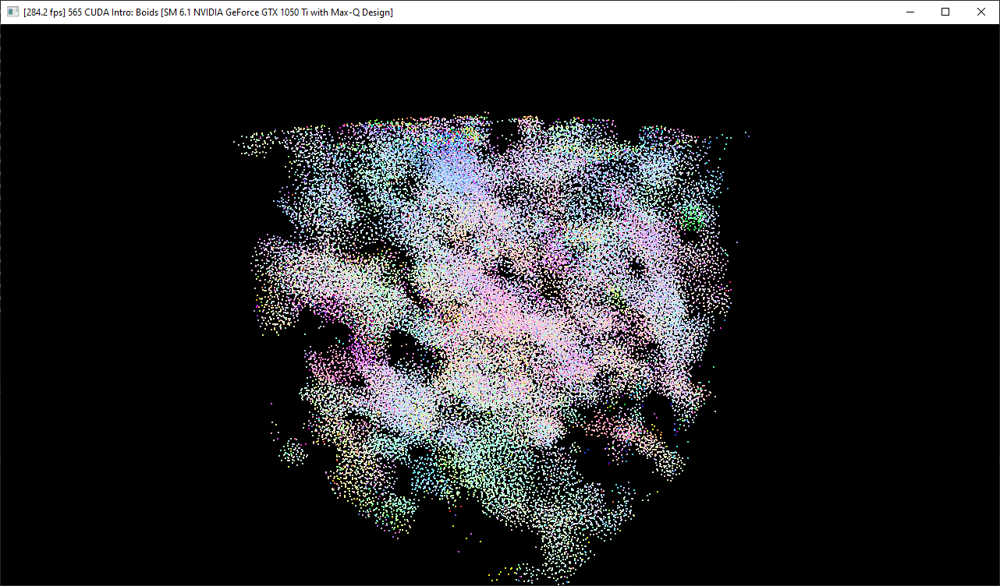

Project 1 Flocking
====================

**University of Pennsylvania, CIS 565: GPU Programming and Architecture,
Project 1 - Flocking**

* Raymond Yang
	* [LinkedIn](https://www.linkedin.com/in/raymond-yang-b85b19168)
	* Tested on: 
		* 09/13/2021
		* Windows 10
		* NVIDIA GeForce GTX 1080 Ti. 
	* Submitted on: 09/13/2021

## Introduction
The objective of this project was to mimic basic flocking behavior between boids. Boids are arbitrary representations of points in 3D space. Each boid follows three rules: 
* [Rule 1](https://github.com/CIS565-Fall-2021/Project1-CUDA-Flocking/blob/main/INSTRUCTION.md#rule-1-boids-try-to-fly-towards-the-centre-of-mass-of-neighbouring-boids): Boids try to fly towards the centre of mass of neighbouring boids.
* [Rule 2](https://github.com/CIS565-Fall-2021/Project1-CUDA-Flocking/blob/main/INSTRUCTION.md#rule-2-boids-try-to-keep-a-small-distance-away-from-other-objects-including-other-boids): Boids try to keep a small distance away from other objects (including other boids).
* [Rule 3](https://github.com/CIS565-Fall-2021/Project1-CUDA-Flocking/blob/main/INSTRUCTION.md#rule-3-boids-try-to-match-velocity-with-near-boids): Boids try to match velocity with near boids.

This project does not implement any form of obstacles within the 3D space. Rule 2 only accounts for neighboring boids. This project is intended as an introduction to CUDA programming and data accessing and handling within GPU memory space. 

## Demo 

### Naive Demo Gif
20,000 boids screenshot: 

20,000 boids GIF:

60,000 boids screenshot: 

60,000 boids GIF:

120,000 boids screenshot: 

120,000 boids GIF:

### Scattered Grid Demo Gif
20,000 boids screenshot: 

20,000 boids GIF:

60,000 boids screenshot: 

60,000 boids GIF:

120,000 boids screenshot: 

120,000 boids GIF:

### Coherent Grid Demo Gif
20,000 boids screenshot: 

20,000 boids GIF:

60,000 boids screenshot: 

60,000 boids GIF:

120,000 boids screenshot: 

120,000 boids GIF:

## Implementation 

### Naive Implementation
Naive Implementation took a simplistic approach to calculating each rule. To compute the rules, each individual boid would observe every other boid in the 3D space and return a comulative velocity. The position and velocity of a boid would be factored into the comulative velocity if it fulfilled the distance conditions: `rule1Distance`, `rule2Distance`, and `rule3Distance`.

### Scattered Grid Implementation
Scattered Implementation used a grid data structure that represented smaller spaces (cells) within the 3D space. This data structure utilized: `dev_particleArrayIndices`, `dev_particleGridIndices`, `dev_gridCellStartIndices`, and `dev_gridCellEndIndices`. These structures allowed the dereferencing of boid position and velocity vectors based on their 3D space. Each individual boid observes the position and velocity vectors of every other boid within a 2x2 cube of cells (lengths defined by `gridCellWidth`) and, given they satisfy `rule1Distance`, `rule2Distance`, and `rule3Distance`, are incorporated into a cumulative velocity and returned. 

### Coherent Grid Implementation
Coherent Implementation is similar to Scattered Implementation. However, the data structures are altered such that we parallelize memory dereferences to improve performance. 

## Analysis

### Data Comparison
| Boids   | Naive FPS | Scattered FPS | Coherent FPS |
|---------|-----------|---------------|--------------|
| 20,000  | 25.8      | 674.9         | 743.4        |
| 60,000  | 3.0       | 276.6         | 399.6        |
| 120,000 | 0.8       | 124.4         | 198.0        |

### Questions
* Framerate is inversely proportional to number of boids. As the number of boids increase, the framerate decreases. This is due to the increased density of boids. Since cells are fixed size, the average number of boids in each cell increases leading to more serialized calculations. 
* Decreasing the block count negatively affected performance. As we decrease number of blocks, number of warps increased. Blocks can be parallelized by warps within an SM is serialized. 
* The coherent grid structure increased performance. The purpose of this step was to parallelize two memory dereferences rather than performing them in serial (like in scattered grid implementation).
* Checking more cells in my implementation seemed to have negligible effects. While increasing the cells a boid must iterate through, other factors such as syncronization and stalling are also affected. 

## Notes
* One late day used. 