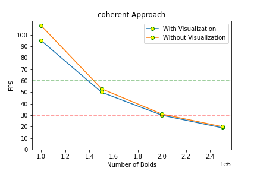

<p align="center">
  
  <h2 align="center">Author: (Charles) Zixin Zhang</h2>
  <p align="center">
    A flocking simulation based on the <strong>Reynolds Boids algorithm</strong>
  </p>
</p>

--- 
## About The Project
<p align="center">

</p>


A flocking simulation based on the <strong>Reynolds Boids algorithm</strong>, along with two levels of optimization: a <strong>uniform grid</strong>, and a <strong>uniform grid with semi-coherent memory access</strong>.

--- 
## Highlights

<p align="center">

  
  
</p>


Stats: 
- Coherent uniform grid approach
- CPU: i7-10700F @ 2.90GHz
- GPU: SM 8.6 NVIDIA GeForce RTX 3080
- Number of Boids: 12 million 
- Average FPS: ~40

Note: For the first picture, I use a larger timestep to speed up the simulation to observe the overall trend better, whereas the second picture uses a smaller time step to better observe the movement of the particles (it also looks cool :sunglasses:).

--- 

## Performance Analysis

In this project, I investigate 3 approaches to implement the Reynolds Boids algorithm:

1. Naive approach has each boid check every other boid in the simulation. 
2. Uniform grid approach culls unnecessary neighbor checks using a data structure called a uniform spatial grid. 
3. Coherent uniform gird approach improves upon the second approach by cutting one level of indirection when accessing the boids' data.

---
To validate our optimization, I use ```Matplotlib``` to plot the framerate change with an increasing number of boids for these 3 approaches. Average framerate is observed visually. Note that the below experiment has ```scene_scale=100.0f``` because it will affect FPS based on the number of particles in the scene. Additionally, I consider 30~60 FPS to be an acceptable framerate. 




Based on the above 3 plots, I conclude that there is approximately **x10** efficiency improvement (in terms of the number boids the method can handle) per step going from the naive approach to the coherent uniform grid approach. For example, the naive approach can handle tens of thousands of particles, whereas the coherent grid approach can handle millions of particles with ease. Our optimization works as expected because of two factors:

1. We have culled tons of neighbor checks by only checking particles in at most 8 cells. 
2. We have eliminated the need for another indirection happened when accessing the position/velocity arrays. This is done by reshuffling them so that all the velocities and positions of boids in one cell are contiguous in memory. 

Furthermore, the program runs more efficiently without visualization. Drawing all the boids in OpenGL takes time and resources. 

---
I also plot framerate change with increasing block size to investigate the effect of block size on the efficiency of the algorithm. Note that the following parameters are used when running this experiment:

- Visualization: off
- Approach: coherent grid
- Number of boids: 50000
- scene_scale: 100.0f


At ```blocksize=1024```, the program achieves the highest framerate. 

---
In this implementation, the cell width of the uniform grid is hardcoded to be twice the neighborhood distance. Therefore, the program can get away with at most 8 neighbor cell checks. However, if I change the cell width to be the neighborhood distance, 27 neighboring cells will need to be checked. To investigate this further, two setups are used to compare the performance: 

1. Uniform grid approach with 50000 boids
2. Uniform grid approach with 500000 boids

Using the first setup, checking 27 cells with ```gridCellWidth = std::max(std::max(rule1Distance, rule2Distance), rule3Distance);``` didn't noticeably impact the performance with 50000 boids sparsely populating the space. Using the second setup with densely populated boids in the space, checking 27 cells provides better performance than checking only 8 cell.
