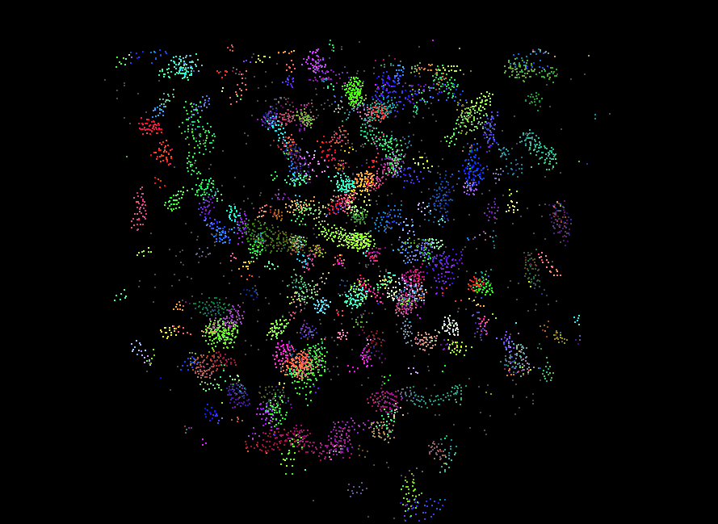

**University of Pennsylvania, CIS 565: GPU Programming and Architecture,
Project 1 - Flocking**

* Beini Gu
  * [LinkedIn](https://www.linkedin.com/in/rgu/), [personal website](https://www.seas.upenn.edu/~gubeini/), [twitter](https://twitter.com/scoutydren), etc.
* Tested on: Windows 10, AMD Ryzen 7 3700X 8-Core Processor 3.59 GHz 16GB, GTX 2060

### CUDA Boids Flocking

#### Visualization results 

* visualization with 8000 boids

* Animated

****

#### Performance Analysis

##### Variant: Changing number of boids

* **naive boids** implementation

  * with visualization (vis fps can exceed 60fps, vertical sync off) 

    

  * simulation only

    
    
  * **Results: ** FPS decreases logarithmically as number of boids increases. Same decreasing profile with and without visualization. Having visualization results in extra computing costs which in general slows down the performance.  One possible reason for explaining this performance slowdown with number of boids was in `kernUpdateVelocityBruteForce` and `computeVelocityChange`, we are looping through all the boids that exists in the entire scene non-parallel checking if each one of them is within a "rule distance". 

* **scattered uniform grid** implementation

  * with visualization

     

  * simulation only

    

  * **Results**: FPS decreases as number of boids increases, but the rate of decreasing, compared to naive boids implementation, is much slower, which indicates much stronger performance compared to the naive boids method as we are only checking boids in neighboring cells instead of all the boids. The reason which the program still slows down after the number of boids reaches really big is that in `kernUpdateNeighborSearchScattered`, we are looping from the start index to the end index, this loop will gets bigger if the number of boids gets bigger. 

* coherent uniform grid implementation

  * with visualization
  * simulation only

##### Variant: Changing block size

* naive boids implementation
* scattered uniform grid implementation 
* coherent uniform grid implementation

##### Variant: Changing width of each cell

* For the coherent uniform grid: did you experience any performance improvements
  with the more coherent uniform grid? Was this the outcome you expected?
  Why or why not?
* Did changing cell width and checking 27 vs 8 neighboring cells affect performance?
  Why or why not? Be careful: it is insufficient (and possibly incorrect) to say
  that 27-cell is slower simply because there are more cells to check!