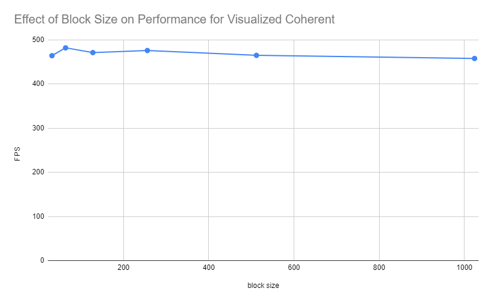

**University of Pennsylvania, CIS 565: GPU Programming and Architecture,
Project 1 - Flocking**

* Kaan Erdogmus
  * [LinkedIn](https://linkedin.com/in/kaanberk), [personal website](https://kaan9.github.io)
* Tested on: Windows 10, i7-8850H @ 2.592GHz 24GB, Quadro P1000

## Project Overview

This project is a flocking simulation that implements the
[Reynold Boids](http://www.vergenet.net/~conrad/boids/pseudocode.html)
algorithm on the GPU using CUDA.

For each boid, its velocity is adjusted at each time-step based on 3 rules:
1. Cohesion: the boid moves towards the center of its neighbours.
2. Separation: the boid tries to maintain a minimum distance from other boids
3. Alignment: the boid tries maintain a similar velocity (including direction) as its neighbours.

## Features Implemented
* Naive Neighbour Search
	* every boid iterates over every boid to calculate rule values
* Uniform-grid based neighbour search
	* space is split into cubic cells and each boid only looks at nearby cells
* Coherent uniform-grid based neighbour search
	* in addition to the above, position and velocity buffers are rearranged before accesses to reduce memory
	indirection.
	* Grid-loop optimization: only checks adjacent cells that are close enough for one of the 3 rules

## Performance Analysis
Due to the complexity of the distribution and minor fluctuations in available GPU performance, the FPS does not stabilize at an exact value and has small differences between separate executions. As such, the following data was collected by
initiating the simulation, waiting for it to relatively stabilize and taking an average of 3 consecutive FPS measurements.

As expected, for each of the implementations, increasing the number of boids results in a decrase in performance. For the naive case, the reason is clear; each boid has to iterate over a greater number of boids. For the uniform and coherent case, the reason is that the GPU has limited capacity (both in memory and number of parallel CUDA kernels) and having a large number of boids, even if they are all checking a smaller number of neighbours, takes a longer time to be processed.

This chart also shows that the uniform grid optimization is more efficient than the naive implementation and
that the coherent grid is the most efficient. The coherent grid's increase in performance is expected as it removes
unnecessary memory indirection (pointer dereference) for each neighbour of each boid by rearranging the position and
velocity vectors beforehand. Rearranging takes a single read and write per position and velocity index whereas
the indirection (in uniform grid) requires an additional read per every pair of neighbours, which, especially for denser
concentrations with higher boid count is significantly larger.

Furthermore, turning of visualization increases performance in all cases, also an expected result as visualizing the boids consumes gpu resources.

Changing the block size does not result in a significant performance change. As we are not using shared memory and all
memory accesses are global, it is not surprising that the size of a block not be a relevant factor.

Checking 27 versus 8 (versus the grid-optimized code) did not result in a significant performance difference for the given cell width. This is most likely due to the fact that there are relatively few boids surrounding each boid and checking a few more cells does not results in checking a much larger number of boids.
However, for larger cell width, the change does start to be more noticeable. This is likely because we are now
unnecessarily iterating over many more neighbouring boids that are not close enough to be considered by
the flocking rules. As a rough approximation, on average, at least (27-8)/27 = 19/27 of the boids we encounter are irrelevant which becomes more significant with a larger cell width that causes more irrelevant boids in each cell.
