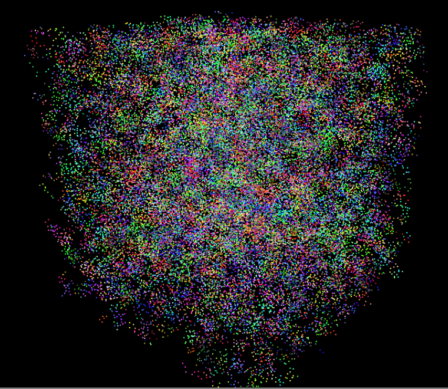
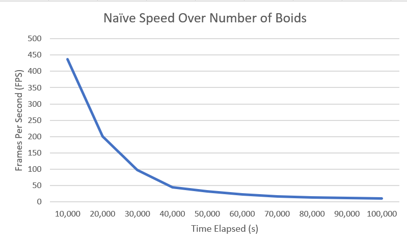

<h1 align="center">Flocking Simulation w/ CUDA</h1>

A flocking simulation based on the **Reynolds Flocking algorithm** that mimics the behavior exhibited when a group of birds, called a flock, are foraging or in flight.

Two levels of optimizations were added to the implementation to significantly improve the performance: **Scattering Uniform Grids** and **Coherent Uniform Grids**.

**University of Pennsylvania, CIS 565: GPU Programming and Architecture,
Project 1 - Flocking**

* Anthony Mansur
  * https://www.linkedin.com/in/anthony-mansur-ab3719125/
* Tested on: Windows 10, AMD Ryzen 5 3600, Geforce RTX 2060 Super (personal)

# Videos

High number of boids: https://drive.google.com/file/d/1OR57owe2Tcw4ikUtUmHmEYstSUxrT7kX/view?usp=sharing

# Screenshots 

Below are some screenshots of the boids simulation running. The ones with fewer boids were run with the naive implementation at N=50,000. The ones with more boids were run with the coherent uniform grids at N=300,000.

## Few Boids Noisy

## Few Boids Flocking 1

## Few Boids Flocking 2

## Many Boids Noisy

## Many Boids Flocking 1

## Many Boids Flocking 2

## Many Boids Flocking 2

# Performance Analysis

To test the performance of the three implementations, CUDA events were used to measure the execution time of each step function in the simulation (See: https://developer.nvidia.com/blog/how-implement-performance-metrics-cuda-cc/)

## Baseline
To compare the speed of the brute force, scattered uniform grid, and coherent uniform grid implementations, the average fps between 10 second intervals was calculated for a total of 100 seconds, at N = 100,000, DT = 0.2f, and blockSize = 128. As shown in the graphs below, the coherent uniform grid implementation is significantly faster than the scattered, and the scattered is signficantly faster than the brute-force implementation.

## FPS as a Function of Number of Boids
Next, we want to see how the fps of each implementation various as we increase the number of boids in the simulation. To do this, we calculate the average fps of the simulation at a 10 second runtime for each implementation. We keep DT = 0.2f and blockSize = 128. For the brute-force implementation, we go from N=10,000 to N=100,000. For the scattered uniform grid implementation, we go from N=100,000 to N = 550,000, and for the coherent uniform grid implementation, we go from N=100,000 to N = 1,000,000.

Although any conclusion made are very empirical, we can see that just how much boids each implementation can take before the fps goes to very small levels. Fun fact, it took N = 2,750,000 to get the coherent implementation to the same fps as the scattered at 550,000.

### FPS as a Function of Block Size
I ran the coherent uniform grid implementation at N=100,000 and varied the block size from 32 to 1024 by an increment of 32. As shown in the plot below, the performance changed noticeably.

## Questions

**For each implementation, how does changing the number of boids affect performance? Why do you think this is?**

For all implementions, increasing the number of boids negatively affects performance. This is due to several reasons. Although we run things in parallel, increasing the number of boids in the simulation results in each thread having to do more work. For the naive implementation, as each thread iterates through every boid in the simulation, the performance worsens very quickly as a function of N. For the uniform grid implementations, although we limit the number of boids to iterate over, increasing N increases the number of neighbors each boid has, on average. So, that is why we still see a performance decrease as N increases for these two implementations, although the performance dip is less extreme since we limit the search for each boid.

**For each implementation, how does changing the block count and block size affect performance? Why do you think this is?**

I only tested this for the coherent implementation as doing this analysis took a while given that I did so in an increment of 32 blocks. However, changing the block count and size affected performance noticeably, but not in a very clear trend. The performance varied throughout, but seemed to have increased from 320 threads per block to 800 threads per blocked, and were lower out of this range.

The number of threads per block affect the resources used at each streaming multiprocessor, and as these resources change, we may make more outside calls to memory causing latency, and we may end up with a lower amount of warps at each SM leading to even more latency. Finding which block size maximizes performance is quite difficult, as it being researched by people at the top of the field. But, it's not a surprise to see the results. Obviously, if our block size is too low, since there is a limit as to how many blocks an SM can hold, we will see performance hits. If the number of threads per block increases too much, we won't be able to add more blocks given the limit of threads per SM. If those limited number of blocks use too many resources, there will also be a limit to the number of warps held per SM, leading to more performance hits.

**For the coherent uniform grid: did you experience any performance improvements with the more coherent uniform grid? Was this the outcome you expected? Why or why not?**

Yes, there are two main reasons why we see a significant performance improvement. First, there is one less call to shared memory by removing the middleman. Second, since the boids are ordered based on proximity, the call to shared memory will be much quicker than before. Although ordering the memory is time-consuming, the benefit exceeds the cost when parallel programming.

**Did changing cell width and checking 27 vs 8 neighboring cells affect performance? Why or why not? Be careful: it is insufficient (and possibly incorrect) to say that 27-cell is slower simply because there are more cells to check!**

Yes. I ran the simulation at N=100,000. When I changed the cell width to half its size, the simulation ran much faster, at 2403 fps compared to 1068fps before the change. This is because when we make the cell grids lower, we have a more fine-grained search for neighboring boids, and we potentially discard boids that we would've checked if the cells were larger. So, even though we have to make more calls to shared memory, we perhaps eliminate additional calls to boids that weren't neighbors.

However, when I ran my simulation at N = 50,000 at scattered uniform grid (coherent was too fast that it broke my simulation at a small N), the fps decreased to 10fps. This is because at this N, the number of neighbors, on average, are smaller so this extra check is disadvantageous. Plus, for scaterred uniform grid, we have the middleman so this extra cell calls are more expensive.

