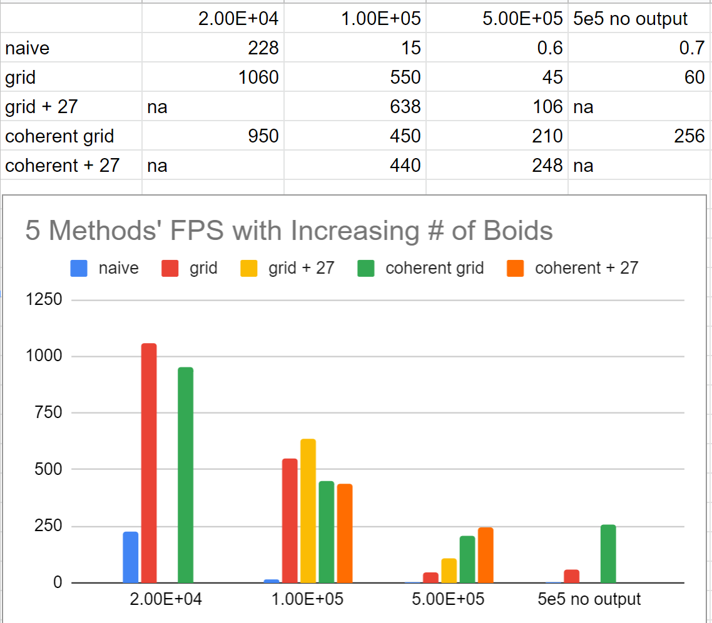

**University of Pennsylvania, CIS 565: GPU Programming and Architecture,
Project 1 - Flocking**

* Zirui Zang
  * [LinkedIn](https://www.linkedin.com/in/zirui-zang/)
* Tested on: Windows 10, AMD Ryzen 7 3700X @ 3.60GHz 32GB, RTX2070 SUPER 8GB (Personal)

### Screenshots
These screenshots are cpatured with 5e5 particles simulation.

Part 1: Naive method (Brute force searching)

Part 2.1: Grid method (Grid searching)

Part 2.1: Coherent Grid method (Enhanced memory access)

### Gifs
20000 Particles

50000 Particles

1000000 Particles

### Performance Summary
5 Methods' FPS with Increasing # of Boids

3 Methods' FPS with Increasing Blacksize

1. For each implementation, increasing number of boid cause decrease in FPS. There are more particles to calculate also more traffic at the memory.
2. Per my experiments, changing block size does not affect FPS. This is probably because large block size results more synchronized computation, which is not shown in this project.
3. Changing to coherent uniform grid does improve the performance with 5e5 or more particles, but not improving with 1e5 or less particles. This is because the benefit of having aligned memory access can only become larger than the cost of sorted the list when the particles base is large enough.
4. Changing grid width and using 27 neighoring cells actually increase the performance. This is more prominent in the grid method than in the coherent grid method. This is because having smaller checking range leads to fewer memory accesses, which is more important in the grid implementation than in coherent implementation.
