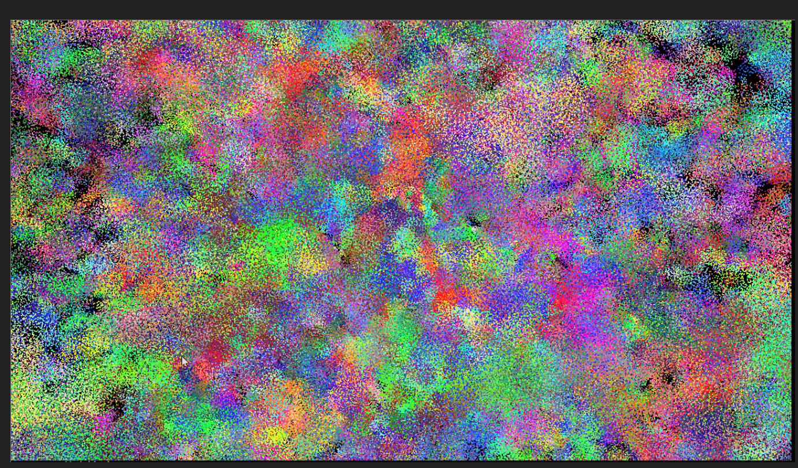

**University of Pennsylvania, CIS 565: GPU Programming and Architecture,
Project 1 - Flocking**

* Anthony Mansur
  * https://www.linkedin.com/in/anthony-mansur-ab3719125/
* Tested on: Windows 10, AMD Ryzen 5 3600, Geforce RTX 2060 Super (personal)

Submission
====================

## GIF

High number of boids: https://drive.google.com/file/d/1OR57owe2Tcw4ikUtUmHmEYstSUxrT7kX/view?usp=sharing

## Screenshots 

### Few Boids Noisy

### Few Boids Flocking 1

### Few Boids Flocking 2

### Many Boids Noisy

### Many Boids Flocking 1

### Many Boids Flocking 2

### Many Boids Flocking 2

## Performance Analysis

### Questions

ADD HERE

### Graphs & Explanation

ADD HERE

